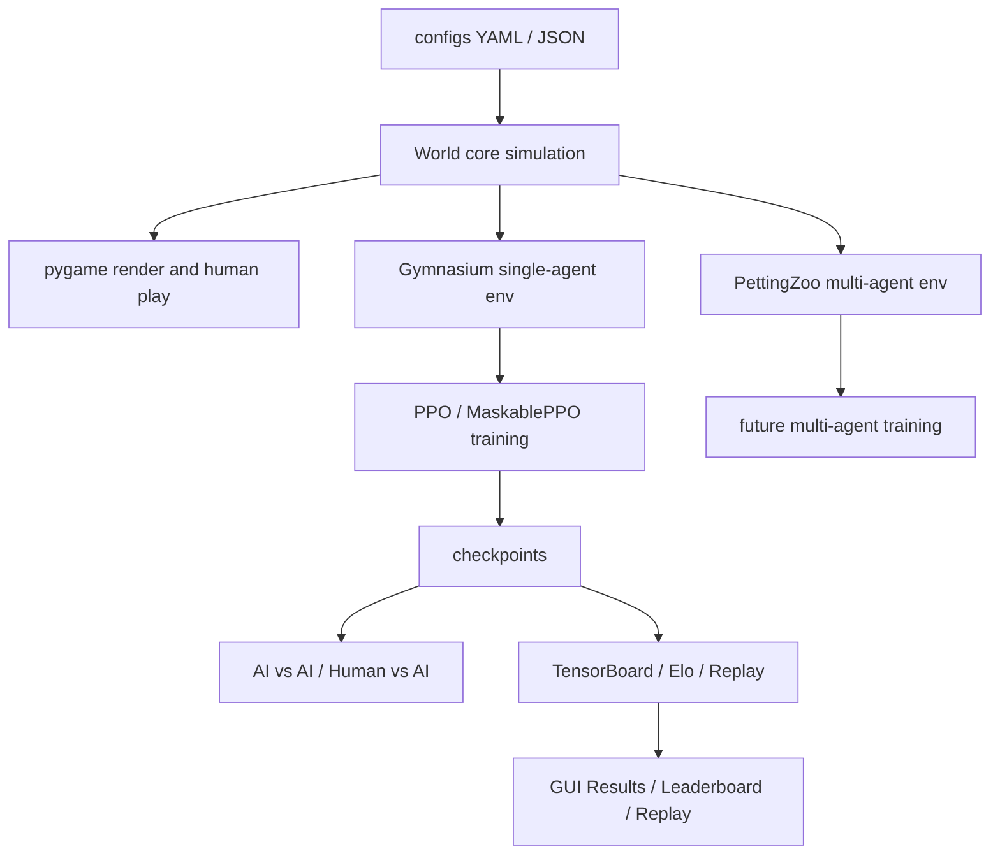

# Library Escape 期末報告

## 從 Python 遊戲到強化學習訓練環境

本報告把目前 `Library Escape` 的 Python 遊戲、pygame 顯示、Gymnasium 強化學習環境、PPO/MaskablePPO 訓練、self-play、reward shaping、GUI 與迭代歷程整理成一份完整說明。寫法刻意用比較白話的方式，讓第一次接觸 Python 遊戲或強化學習的人，也能從專案架構一路看到訓練設計。

## 摘要

`Library Escape` 是一個以圖書館為場景的 2D 潛行與對抗遊戲。玩家需要在有限時間內收集目標、躲避敵人視野，並在特定模式中完成逃脫；敵人則需要巡邏、偵測、追擊或阻止玩家完成任務。本專題的重點不只是完成一個可以操作的遊戲，而是進一步把遊戲改造成一個可以訓練 AI agent 的強化學習環境。

在開發過程中，我把遊戲拆成「世界模擬」、「視覺呈現」、「RL API」、「訓練流程」、「分析工具」五個層次。世界模擬負責角色座標、速度、碰撞、視野、道具、勝負條件；pygame 負責把世界畫出來；Gymnasium 與 PettingZoo 負責把遊戲包成 RL 可訓練格式；Stable-Baselines3 與 sb3-contrib 負責 PPO、MaskablePPO、VecNormalize、checkpoint；GUI、TensorBoard、Elo 與 replay 則負責讓訓練過程可以操作、可以觀察、可以比較。

本專題最有挑戰的地方在於：強化學習 agent 不一定會照人類直覺「好好玩遊戲」。如果 reward 設計不精準，敵人可能學會原地旋轉刷視野，玩家可能因為怕被扣分而原地不動，兩方 self-play 也可能因為強弱差距太大而失去學習訊號。因此本專題後期的重點，就是透過 reward shaping、action mask、連續時間物理、轉向硬上限、observation 擴充與 self-play curriculum，逐步修正這些問題。

最後完成的系統是一套完整的 Python 強化學習遊戲實驗平台：可以人類遊玩、AI 對戰、單獨訓練玩家或敵人，也可以讓玩家與敵人 self-play 互相進步。這份報告會依照「問題是什麼、程式怎麼設計、RL 怎麼接上去、訓練中遇到什麼問題、後續怎麼修正」的順序說明整個專題。

## 關鍵字

Python、pygame、Gymnasium、PettingZoo、Stable-Baselines3、PPO、MaskablePPO、Self-play、Reward Shaping、Action Masking、VecNormalize、CUDA、TensorBoard、Elo、Replay

## 報告導讀

這份報告可以用三種角度閱讀。

如果想先理解專題在做什麼，可以先看第 1 到第 3 章。這幾章說明遊戲規則、專題動機、整體架構，以及為什麼這個題目適合用強化學習處理。

如果想看技術實作，可以看第 4 到第 13 章。這些章節說明 pygame 遊戲 loop、連續時間物理、Gymnasium API、action space、observation space、reward 設計、硬性物理限制、CUDA/GPU 與訓練流程。

如果想看專題成果與迭代，可以看第 14 到第 23 章。這些章節整理 GUI、TensorBoard、Elo、replay、每一版修改的原因、訓練改善策略、限制、未來工作、心得反思與總結。

## 目錄

1. 專案目標：說明本專題想完成的遊戲與 AI 訓練目標。
2. 遊戲規則：介紹 Collection 與 Escape 兩種模式，以及它們如何轉成 RL 任務。
3. Python 專案架構：說明世界模擬、設定檔、RL API、訓練與 GUI 的分層。
4. pygame 遊戲架構：說明畫面、事件、HUD、音效與 replay 的角色。
5. 連續時間：說明為什麼從離散更新改成固定物理步長。
6. Gymnasium 環境：說明 `reset()`、`step()`、MDP 與 PettingZoo 多智能體介面。
7. Action Space：說明玩家與敵人可以做哪些動作。
8. Action Mask：說明如何避免 agent 選到明顯無效的動作。
9. Observation Space：說明 AI 看見哪些狀態，以及 reward 如何使用這些資料。
10. Reward 系統：說明 Collection/Escape reward、權重、公式與 anti-exploit 設計。
11. 硬性物理限制：說明速度、轉向、碰撞、視野與支援敵人限制。
12. 訓練套件與 Python 環境：說明套件安裝、CUDA、GPU/CPU device。
13. 訓練方式：說明 PPO、MaskablePPO、VecNormalize、self-play 與評估指標。
14. GUI 圖形化介面：說明如何用圖形介面操作遊戲與訓練。
15. Replay、TensorBoard 與 Elo：說明如何觀察、比較與回放模型。
16. 迭代過程：整理 Git commit 與每一版調整的原因。
17. 訓練改善原因：把實作調整對應到強化學習理論。
18. 設計取捨、限制與未來工作：說明目前版本的邊界與可延伸方向。
19. 測試：整理單元測試、smoke test 與驗證方法。
20. 常用指令：整理 GUI、遊玩、訓練、GPU 與 smoke train 指令。
21. 參考資料：列出官方文件、論文與本專題採用原因。
22. 心得與反思：說明從程式與強化學習角度得到的收穫。
23. 結論：總結本專題完成的系統與學習成果。

## 專題貢獻

本專題的主要貢獻可以整理成六點：

1. 建立一套完整 Python 遊戲架構：包含世界模擬、角色、敵人、道具、碰撞、視野、勝負條件與 pygame 顯示。
2. 把遊戲轉換成強化學習環境：提供 Gymnasium 單智能體環境與 PettingZoo 多智能體環境，讓 RL library 可以直接訓練。
3. 設計兩種遊戲模式：`Collection` 側重收集分數與躲避偵測，`Escape` 側重完成目標與逃脫對抗。
4. 建立完整 reward shaping 系統：依模式分開 reward，加入 terminal reward、dense progress reward、alignment reward、anti-exploit penalty。
5. 建立可操作的訓練工具鏈：支援 PPO、MaskablePPO、VecNormalize、self-play、opponent pool、adaptive timestep、checkpoint、resume。
6. 建立可觀察的實驗介面：GUI 可啟動遊戲、訓練模型、查看 TensorBoard、建立 Elo leaderboard、播放 replay、管理訓練成果。

## 最終成果總覽

目前專案已經不是單一遊戲檔案，而是一套完整的 Python package。最後成果可以分成遊戲能力、強化學習能力、工程與操作能力三類。

### 遊戲能力

- 圖書館地圖與可通行/不可通行區域。
- 玩家、主敵人、支援敵人。
- 桌子、書架、邊界碰撞。
- 敵人視野錐與遮蔽物 line-of-sight 判斷。
- `note`、`exam`、`coffee`、`freeze` 四種 collectible。
- `Collection` 與 `Escape` 兩種模式。
- 開局保護、收集延遲、偵測冷卻、凍結效果。
- pygame 視窗、HUD、音效與 replay。

### 強化學習能力

- `Gymnasium` 單智能體環境。
- `PettingZoo` 多智能體環境。
- 離散 action space 與 continuous action 支援。
- invalid action mask。
- mode-aware vector observation。
- mode-aware reward shaping。
- PPO / MaskablePPO。
- self-play、opponent curriculum、adaptive timesteps。
- VecNormalize、checkpoint、resume、eval、TensorBoard。

### 工程與操作能力

- GUI 啟動遊戲與訓練。
- 訓練 ETA、FPS、reward 顯示。
- Elo leaderboard。
- replay 錄製與回放。
- CPU / CUDA device report。
- smoke test 與單元測試。

## 報告依據與主要檔案

本報告不是只根據最後執行結果撰寫，而是整理目前 repo 中的程式碼、設定檔、文件與 Git commit 紀錄。主要參考檔案如下：

| 類別 | 主要檔案 | 報告中對應內容 |
|---|---|---|
| 世界模擬 | [`library_escape/core/world.py`](../library_escape/core/world.py) | 連續時間、遊戲規則、收集、抓捕、逃脫、transition metrics |
| 角色與物理 | [`library_escape/core/character.py`](../library_escape/core/character.py)、[`library_escape/core/physics.py`](../library_escape/core/physics.py) | 速度、轉向上限、碰撞、raycast |
| 事件紀錄 | [`library_escape/core/events.py`](../library_escape/core/events.py) | StepEvents、位移、轉向、偵測、收集、anti-exploit telemetry |
| RL 環境 | [`library_escape/env/single_agent_env.py`](../library_escape/env/single_agent_env.py)、[`library_escape/env/multi_agent_env.py`](../library_escape/env/multi_agent_env.py) | Gymnasium、PettingZoo、reset/step、terminated/truncated |
| Observation | [`library_escape/env/obs_builder.py`](../library_escape/env/obs_builder.py) | 玩家與敵人 observation space |
| Action mask | [`library_escape/env/action_masking.py`](../library_escape/env/action_masking.py) | invalid action masking |
| Reward | [`library_escape/rewards/reward_fns.py`](../library_escape/rewards/reward_fns.py) | reward 計算、potential、dense shaping、anti-exploit |
| 訓練 | [`library_escape/train/common.py`](../library_escape/train/common.py)、[`library_escape/train/train_selfplay.py`](../library_escape/train/train_selfplay.py) | PPO、MaskablePPO、VecNormalize、self-play、device、resume |
| GUI | [`library_escape/gui/app.py`](../library_escape/gui/app.py) | 圖形化操作、訓練控制、結果瀏覽 |
| 設定 | [`configs/env.yaml`](../configs/env.yaml)、[`configs/training.yaml`](../configs/training.yaml)、[`configs/rewards_collection.yaml`](../configs/rewards_collection.yaml)、[`configs/rewards_escape.yaml`](../configs/rewards_escape.yaml)、[`configs/map.json`](../configs/map.json) | 遊戲參數、reward 權重、訓練超參數、地圖 |

## 1. 專案目標

這個專案的核心是一個圖書館潛行對抗遊戲。玩家在圖書館地圖中移動、收集道具或完成目標；敵人會巡邏、偵測玩家、追擊或阻止玩家完成任務。專案的重點不只是做出可以玩的遊戲，而是把遊戲整理成一個可以被強化學習演算法訓練的環境。

因此，最後的成果包含三個層次：

1. 遊戲本體：用 Python 建立連續時間的世界模擬、碰撞、視野、道具、勝負條件。
2. RL 環境：用 Gymnasium 包成單智能體訓練環境，也用 PettingZoo 包成多智能體環境。
3. 訓練工具：用 Stable-Baselines3、sb3-contrib、PPO、MaskablePPO、VecNormalize、TensorBoard、Elo、GUI 來訓練與分析模型。

整個專案可以從命令列操作，也可以從圖形化介面操作。GUI 是後來為了降低使用門檻加入的，因為訓練過程中如果每次都要在 terminal 輸入一長串指令，很容易打錯路徑、選錯模式、忘記 checkpoint 或看不懂訓練輸出。

### 1.1 專題動機

一般遊戲 AI 常見做法是寫規則，例如「看到玩家就追」、「到定點就巡邏」、「離玩家太遠就回路線」。這種寫法直觀、可控，也很適合做 baseline。不過它的限制也很明顯：所有行為都要由程式設計者事先想到，AI 不太可能自己發現新的策略。

強化學習的想法則不同。它不是直接告訴 agent 每一步要怎麼走，而是定義：

1. agent 看得到什麼狀態。
2. agent 可以做哪些 action。
3. 做完 action 後環境怎麼變。
4. 哪些結果會得到獎勵或懲罰。

然後讓 agent 透過大量互動自己學習策略。這很適合 `Library Escape`，因為這個遊戲天然就有「追與逃」、「收集與阻止」、「短期安全與長期目標」之間的取捨。例如玩家看到敵人時，不一定只是逃跑；有時候繞路拿最後一個 note 更重要。有時候敵人也不是直線追玩家，而是應該守在出口或收集目標附近。

因此，本專題的動機可以整理成一句話：把一個人類能理解的潛行遊戲，轉換成一個 AI 可以反覆練習、犯錯、修正並逐漸形成策略的訓練場。

### 1.2 核心問題

這個專題真正要解決的不是「怎麼呼叫 PPO」而已。只要安裝套件，呼叫 PPO 並不難；真正困難的是把遊戲設計成 RL 能學的問題。開發中主要面對下列問題：

| 問題 | 如果沒有處理會怎樣 | 本專題的解法 |
|---|---|---|
| 遊戲更新太離散 | 角色移動像跳格子，速度與碰撞不自然 | 改成固定物理步長與連續時間座標 |
| reward 太稀疏 | agent 很久才知道自己做得好不好 | 加入 goal/chase/guard progress 等 dense shaping |
| reward 太容易被鑽漏洞 | 敵人原地旋轉、玩家原地不動也可能拿到局部好處 | 降低 visibility reward，加入 anti-exploit penalty |
| action 太自由 | agent 浪費大量時間撞牆或選無效動作 | 使用 MaskablePPO 與 action mask |
| observation 不夠 | 玩家不知道目標，敵人不知道該守哪裡 | 加入目標方向、出口方向、全道具 slot、模式 flag |
| self-play 失衡 | 強的一方越來越強，弱的一方沒有學習訊號 | 使用 opponent pool、歷史模型、adaptive timesteps |
| 訓練不易觀察 | 只看 terminal log 很難判斷模型變好或變壞 | 加入 GUI、TensorBoard、Elo、replay |

### 1.3 技術路線圖

整個專題可以看成一條逐步堆疊的路線：

```text
遊戲規則
  -> Python 世界模擬
  -> pygame 視覺化
  -> Gymnasium / PettingZoo 環境
  -> PPO / MaskablePPO 訓練
  -> reward shaping 與 anti-exploit
  -> self-play 與 opponent pool
  -> GUI / TensorBoard / Elo / Replay
```

這條路線的邏輯是先讓遊戲本身正確，再讓遊戲可以被 RL 演算法讀懂，最後才開始做訓練與分析。如果前面的世界模擬不穩，後面的訓練結果也會不可靠；如果 observation 或 reward 設計錯誤，演算法再強也可能學到錯誤行為。

### 1.4 研究方法與驗收標準

這個專題的研究方法不是一次把所有功能寫完，而是採用「做出可運作版本，再用訓練結果反過來修正系統」的方式。每一次改版都會經過一個循環：

```text
觀察現象
  -> 判斷問題原因
  -> 修改規則、reward、observation 或訓練流程
  -> 用測試與短訓練確認沒有壞掉
  -> 用 replay、TensorBoard、Elo 觀察行為是否真的改善
```

例如一開始如果只看 reward 數值，可能會誤以為模型已經變好；但 replay 可能顯示敵人其實只是原地轉頭，或玩家只是待在安全處不推進。因此本專題採用「數值指標 + 行為觀察 + 程式測試」三種證據一起判斷，而不是只依賴單一圖表。

本專題的驗收標準可以分成五個層次：

| 層次 | 驗收問題 | 對應方法 |
|---|---|---|
| 遊戲正確性 | 人類玩家是否能正常移動、收集、被偵測、逃脫或失敗 | pygame 遊玩、world rules 測試、replay |
| RL API 正確性 | `reset()` / `step()` 是否符合 Gymnasium，observation/action/reward 是否穩定 | env API 測試、shape 檢查、短訓練 |
| 可訓練性 | agent 是否能從 reward 中學到接近目標的行為 | PPO/MaskablePPO 訓練、eval reward、TensorBoard |
| 抗漏洞能力 | 是否減少原地旋轉、卡牆、站著不動、來回抖動 | anti-exploit telemetry、turn penalty、action mask、replay |
| 可操作性 | 使用者是否能不用記大量指令就啟動訓練與檢查結果 | GUI、preset、run summary、leaderboard |

這樣做的好處是，每個工程決策都有可檢查的目的。例如加入轉向速度上限，不只是讓畫面比較自然，也是為了避免敵人用不合理的高速旋轉刷視野；加入 GUI，不只是讓介面漂亮，而是讓訓練、續訓、觀察與比較可以變成可重複的流程。換句話說，本專題把「遊戲不好訓練」拆成一系列可以被程式處理的小問題，再逐一建立工具解決。

## 2. 遊戲規則

遊戲地圖設定在 [`configs/map.json`](../configs/map.json)。地圖大小是 `33 x 18` 格，每格在 pygame 顯示時對應 `40 px`。雖然地圖用格子描述，但角色座標不是只能站在格子中央，而是使用浮點數座標，例如 `x = 16.5, y = 9.5`。這讓角色可以平滑移動，而不是每次跳一整格。

目前有兩種主要模式：`Collection` 與 `Escape`。兩種模式共用同一套世界模擬，但勝負條件、敵人行為、reward 權重、道具重要性不同。

### 2.1 Collection 模式

`Collection` 模式的目標是收集分數。玩家需要在時間內盡量收集 `note` 與 `exam`。這個模式不以逃到出口為主要結束條件，而是以收集效率和被偵測風險作為核心。

主要規則如下：

| 項目 | 設定 |
|---|---:|
| 回合時間 | `60` 秒 |
| note 數量 | `6` |
| exam 數量 | `2` |
| coffee 數量 | `1` |
| freeze 數量 | `1` |
| note HUD 分數 | 每個 `8` 分 |
| exam HUD 分數 | 每個 `12` 分 |
| 玩家速度 | `4.00` 格/秒 |
| 玩家轉向上限 | `780` 度/秒 |
| 主敵人速度 | `3.65` 格/秒 |
| 敵人轉向上限 | `660` 度/秒 |
| 敵人視野距離 | `5.5` 格 |
| 敵人視野角度 | `52` 度 |
| 開場保護時間 | `1.00` 秒 |
| 被偵測時間懲罰 | `8.0` 秒 |
| 偵測後敵人暫停 | `1.20` 秒 |
| 收集長按時間 | `0.85` 秒 |
| 敵人數量 | 主敵人 `1` 個，加支援敵人 `4` 個 |

在這個模式中，coffee 的效果偏向「加快收集」，freeze 則讓敵人暫時凍結。人類玩家需要長按 `E` 才能收集，AI 訓練時則由環境自動處理收集進度，避免訓練時多一個複雜按鍵動作。

### 2.2 Escape 模式

`Escape` 模式比較像完整的對抗任務。玩家要先收集所有必要的 note，解鎖出口，再走到出口逃脫；敵人則要阻止玩家完成收集，或在玩家逃出前抓到玩家。

主要規則如下：

| 項目 | 設定 |
|---|---:|
| 回合時間 | `60` 秒 |
| 必要目標 | 收集全部 `6` 個 note |
| exam | 可收集但不是逃脫必要條件 |
| 玩家速度 | `4.55` 格/秒 |
| 玩家轉向上限 | `900` 度/秒 |
| 主敵人速度 | `3.55` 格/秒 |
| 敵人追擊速度倍率 | `1.08` |
| 敵人轉向上限 | `780` 度/秒 |
| 敵人視野距離 | `5.3` 格 |
| 敵人視野角度 | `54` 度 |
| 開場保護時間 | `0.75` 秒 |
| 抓捕半徑 | `0.55` 格 |
| 互動半徑 | `1.10` 格 |
| 收集長按時間 | `0.85` 秒 |
| 敵人數量 | 主敵人 `1` 個，加支援敵人 `1` 個 |

玩家如果在可逃脫狀態進入出口區域，就會得到逃脫結果。敵人如果距離玩家小於 `capture_radius = 0.55`，就判定抓到玩家。這個模式的 reward 也更強調終局結果，例如玩家逃脫、玩家被抓、敵人成功抓捕、敵人讓玩家逃走。

### 2.3 玩法如何轉成 RL 任務

對人類來說，這個遊戲的任務很直覺：看到道具就去拿，看到敵人就躲，出口開了就跑。但對 RL agent 來說，遊戲必須被拆成更明確的數學問題。這裡最重要的是把「遊戲直覺」翻譯成「狀態、動作、獎勵」。

| 人類理解 | RL 表達方式 |
|---|---|
| 玩家在哪裡 | observation 中的 player position |
| 敵人在哪裡 | observation 中的 enemy relative position |
| 道具在哪裡 | note/exam/coffee/freeze slots |
| 出口是否開啟 | `can_escape` flag |
| 還剩多少時間 | normalized time remaining |
| 玩家往哪裡走 | action id 0 到 8 |
| 有沒有做對 | reward |
| 遊戲是否結束 | terminated / truncated |

這個轉換是強化學習專案中最關鍵的工程工作之一。因為演算法本身看不懂「勇敢一點去拿道具」或「不要只是躲起來」這種人類語言，只能根據 observation 和 reward 學習。因此我必須把這些抽象期待拆成具體的數值，例如「離目標更近就加一點分」、「完成 note 收集給明確 reward」、「原地不動扣分」、「被抓給重大懲罰」。

### 2.4 兩種模式的教育意義

`Collection` 與 `Escape` 不只是玩法不同，也讓這個專題能展示兩種不同的 RL 任務型態。

`Collection` 比較像 score optimization。玩家不一定有明確的勝利終點，而是要在有限時間內最大化收集分數。這種任務的 reward 比較像累積績效，適合展示如何設計分數導向的 reward。

`Escape` 則比較像 sparse terminal objective。玩家需要完成前置目標，最後逃出出口；敵人則要阻止玩家達成終局。這種任務更能展示 reward shaping 的重要性，因為如果只在最後逃脫才給分，agent 可能很久都拿不到正回饋。所以我在 Escape 裡加入 note reward、objective complete bonus、goal progress、exit guidance，讓 agent 在通往終局的過程中也能得到學習訊號。

## 3. Python 專案架構

Python 版主要程式在 [`library_escape/`](../library_escape)。

整體架構可以用下圖理解：



這張圖的重點是：`World core simulation` 是中心。pygame、Gymnasium、PettingZoo、訓練、replay 都不是各自維護一套規則，而是共用同一個世界模擬。這樣可以避免「訓練時一套規則、播放時另一套規則」的問題。

| 模組 | 功能 |
|---|---|
| [`library_escape/core/`](../library_escape/core) | 世界模擬、角色狀態、物理、碰撞、視野、事件紀錄 |
| [`library_escape/env/`](../library_escape/env) | Gymnasium 單智能體環境、PettingZoo 多智能體環境、observation、action mask |
| [`library_escape/rewards/`](../library_escape/rewards) | reward 計算邏輯 |
| [`library_escape/agents/`](../library_escape/agents) | rule-based baseline、隨機控制器、SB3 checkpoint 控制器、opponent pool |
| [`library_escape/train/`](../library_escape/train) | enemy/player 單獨訓練、self-play、callback、device 管理、續訓 |
| [`library_escape/play/`](../library_escape/play) | 人類 vs AI、AI vs AI 播放 |
| [`library_escape/render/`](../library_escape/render) | pygame 顯示 |
| [`library_escape/replay/`](../library_escape/replay) | replay 錄製與回放 |
| [`library_escape/eval/`](../library_escape/eval) | checkpoint 掃描與 Elo 評估 |
| [`library_escape/gui/`](../library_escape/gui) | 圖形化介面 |
| [`configs/`](../configs) | 環境、地圖、reward、訓練設定 |
| [`tests/`](../tests) | 單元測試與 smoke test |

這種拆法的好處是：pygame 顯示和 RL 訓練不會綁在一起。訓練時可以完全 headless 執行，不需要開視窗；人類遊玩或 AI 觀戰時才用 pygame 把世界畫出來。

### 3.1 架構設計原則

這份專案的架構不是只為了「程式能跑」，而是為了讓後續訓練、測試、調參都能持續進行。主要設計原則有四個：

1. 遊戲邏輯與畫面分離：`World` 不依賴 pygame，所以訓練時可以不開視窗，速度更快，也比較容易寫測試。
2. 規則與參數配置化：地圖、reward、訓練超參數都放在 `configs/`，調參時不需要到程式碼裡亂改。
3. 單智能體與多智能體分層：單獨訓練玩家或敵人時用 Gymnasium；雙方同時互動或 self-play 概念上則用 PettingZoo 表達。
4. 每個關鍵行為都能被測試：碰撞、reward、action mask、續訓、GUI 讀檔都寫成測試，避免後面調 reward 時把核心規則改壞。

### 3.2 資料流

一次 RL 訓練 step 的資料流可以想成下圖：

```text
PPO / MaskablePPO
  -> action id
  -> action_to_vector()
  -> World.step()
  -> StepEvents + transition_metrics
  -> RewardEngine.compute()
  -> observation + reward + terminated/truncated + info
  -> PPO / MaskablePPO 更新 policy
```

對人類遊玩來說，資料流則是：

```text
Keyboard input
  -> player_action
  -> rule-based 或 checkpoint enemy_action
  -> World.step(frame_skip=1)
  -> PygameView.render_frame()
  -> 畫面、音效、HUD、replay
```

這兩條路共用同一個 `World`，代表訓練時的規則和遊玩時的規則一致。這點很重要，因為如果訓練環境和實際遊戲環境不同，模型就可能在訓練中表現很好，但播放時行為失真。

### 3.3 設定檔驅動

本專題大量使用 YAML/JSON 設定檔，主要是為了讓實驗可以快速重複。

| 設定檔 | 負責內容 |
|---|---|
| [`configs/env.yaml`](../configs/env.yaml) | 時間、速度、視野、action、observation、隨機化 |
| [`configs/map.json`](../configs/map.json) | 地圖大小、出生點、障礙物、出口、道具生成點、敵人路線 |
| [`configs/rewards_collection.yaml`](../configs/rewards_collection.yaml) | Collection reward 權重 |
| [`configs/rewards_escape.yaml`](../configs/rewards_escape.yaml) | Escape reward 權重 |
| [`configs/training.yaml`](../configs/training.yaml) | PPO/self-play 超參數、preset、VecNormalize、device |

這樣做的好處是，當訓練出現問題時，可以清楚知道自己改的是哪一層。例如原地旋轉問題主要改 reward 與 turn-rate；撞牆問題主要改 action mask；玩家不知道目標主要改 observation；訓練太慢或不平衡則改 training preset。

### 3.4 如果從零開始的合理開發順序

這類專案不適合一開始就寫神經網路。比較穩定的開發順序是先把世界規則做乾淨，再把它包成 RL 環境，最後才開始訓練：

1. 建立世界狀態：玩家、敵人、道具、時間、分數、出口、地圖障礙。
2. 建立物理更新：速度、位置、碰撞、邊界、連續時間步長。
3. 建立遊戲事件：收集、偵測、抓捕、逃脫、超時、僵局。
4. 建立 pygame 視覺化：先讓人類玩起來合理，確認遊戲規則可理解。
5. 設計 action space：定義 AI 能做哪些動作。
6. 設計 observation space：定義 AI 看得到哪些資料。
7. 設計 reward：定義 AI 怎樣算做得好、怎樣算做得不好。
8. 接上 PPO / MaskablePPO：讓 AI 反覆模擬、收集 rollout、更新 policy。
9. 觀察訓練結果：用 TensorBoard、replay、AI vs AI 找出站樁、亂轉、卡牆、拖時間等問題。
10. 回頭修 observation、reward、action mask、物理限制或訓練設定。

這個順序也解釋了本專題的迭代方式：不是先假設 reward 一定正確，而是先讓系統可以跑，再透過模型行為回頭修正環境。

## 4. pygame 遊戲架構

pygame 的顯示主要在 [`library_escape/render/pygame_view.py`](../library_escape/render/pygame_view.py)。一般 pygame 遊戲會有一個 loop：

```python
while running:
    handle_events()
    update_world()
    render()
```

本專案也是類似概念，但把 `update_world()` 寫在 `World.step()`，把 `render()` 寫在 `PygameView.render_frame()`。

pygame 主要做這些事：

1. 建立視窗：`pygame.display.set_mode(...)`
2. 讀取圖片素材：背景、角色、桌子、書架、note、exam、coffee、freeze
3. 把世界座標轉成畫面像素座標：`pixel = grid_position * cell_size`
4. 畫出背景、障礙物、道具、敵人視野、玩家、敵人、HUD
5. 用 `pygame.display.flip()` 更新畫面
6. 用 `pygame.time.Clock().tick(render_fps)` 控制畫面更新頻率

人類遊玩入口在 [`library_escape/play/human_vs_ai.py`](../library_escape/play/human_vs_ai.py)，AI 對戰入口在 [`library_escape/play/ai_vs_ai.py`](../library_escape/play/ai_vs_ai.py)。這兩個檔案的 loop 都會累積真實時間 `frame_dt`，再用固定物理步長反覆更新世界。

## 5. 從離散時間改成連續時間

強化學習環境很容易一開始寫成「每一步就是一格」或「每一步就是一次大更新」。這樣做簡單，但會讓遊戲動作很不自然，也會讓速度、碰撞、轉向、偵測不夠細緻。

目前版本使用連續時間與固定物理步長：

```yaml
timing:
  render_fps: 60
  physics_hz: 120
  rl_frame_skip: 4
```

意思是：

| 參數 | 意義 |
|---|---|
| `render_fps = 60` | 畫面目標每秒更新 60 次 |
| `physics_hz = 120` | 物理世界每秒更新 120 次 |
| `physics_dt = 1 / 120` | 每個物理子步約 `0.00833` 秒 |
| `rl_frame_skip = 4` | RL agent 每 4 個物理步做一次決策 |
| RL macro-step 時間 | `4 / 120 = 0.03333` 秒 |

這個設計讓遊戲有兩種時間尺度：

1. 物理尺度：角色每 `0.00833` 秒移動一小段，碰撞與視野也在這個尺度更新。
2. RL 決策尺度：agent 每 `0.03333` 秒才選一次 action，避免每一個超小物理步都跑一次神經網路。

以 Escape 模式為例，玩家速度是 `4.55` 格/秒，所以每個 RL macro-step 最多約移動：

```text
4.55 * (4 / 120) = 0.1517 格
```

敵人在追擊時速度約為：

```text
3.55 * 1.08 * (4 / 120) = 0.1278 格
```

這些數字後來也影響 reward 的 anti-exploit threshold。以前如果 threshold 設太大，例如要求單一步移動超過不可能達成的距離，偵測「原地抖動」或「來回震盪」就永遠不會觸發。現在的 `stationary_threshold = 0.05`、`oscillation_path_threshold = 0.08`、`oscillation_net_threshold = 0.04` 就是依照實際 macro-step 移動量調整出來的。

### 5.1 固定物理步長的偽程式碼

播放模式中，畫面更新與物理更新的關係可以用下面的偽程式碼表示：

```python
accumulator = 0.0

while running:
    frame_dt = clock.tick(render_fps) / 1000.0
    accumulator += frame_dt

    while accumulator >= physics_dt:
        player_action = read_keyboard_or_policy()
        enemy_action = read_rule_based_or_policy()
        world.step(
            player_action=player_action,
            enemy_action=enemy_action,
            frame_skip=1,
        )
        accumulator -= physics_dt

    renderer.render_frame()
```

這種寫法的好處是，即使不同電腦畫面更新速度略有差異，物理模擬仍然以固定的 `physics_dt` 前進。訓練時也用同一套 `World.step()`，只是 RL 環境一次傳入 `frame_skip = rl_frame_skip`，讓同一個 action 連續套用幾個物理子步。

### 5.2 為什麼這對 RL 很重要

如果物理步長不固定，agent 每一步 action 對世界造成的影響就不穩定。某次 action 可能移動 `0.05` 格，另一次可能移動 `0.20` 格，reward 中的距離變化也會跟著飄。這對 PPO 這種依靠大量 rollout 估計 advantage 的方法來說很不理想。

固定物理步長讓每一步的尺度更可預期。也因為尺度可預期，我才能合理設定 anti-exploit threshold，例如「一個 macro-step 合理移動量約 `0.12` 到 `0.15` 格，所以低於 `0.05` 可以視為幾乎沒動」。這是程式物理設計與 reward 設計互相影響的一個例子。

## 6. Gymnasium 環境設計

Gymnasium 是 OpenAI Gym 的後續維護版本。它提供一個標準介面，讓不同 RL 演算法都可以用同一種方式和環境互動。官方文件的核心概念是：環境要有 `reset()`、`step(action)`、`observation_space`、`action_space`、`render()`。

本專案的單智能體 Gymnasium 環境是 [`library_escape/env/single_agent_env.py`](../library_escape/env/single_agent_env.py) 裡的 `LibraryEscapeEnv`。

Gymnasium 環境的核心介面可以寫成：

```python
observation, info = env.reset()
observation, reward, terminated, truncated, info = env.step(action)
```

本專案的 `info` 也會放入許多 debug 資訊，例如 action mask、事件、分數、距離、玩家是否被看到等。這些資訊不一定直接餵給 policy，但對測試、GUI、debug reward 非常重要。

每次訓練 step 的流程是：

1. 演算法給一個 action。
2. `action_to_vector()` 把離散 action 轉成移動向量。
3. 如果正在訓練敵人，玩家由 rule-based 或歷史模型控制；如果正在訓練玩家，敵人由 rule-based 或歷史模型控制。
4. 呼叫 `world.step(..., frame_skip=world.rl_frame_skip)`，一次更新 4 個物理子步。
5. 用 `RewardEngine.compute()` 計算玩家與敵人的 reward。
6. 回傳 observation、reward、terminated、truncated、info。

`terminated` 和 `truncated` 分開非常重要：

| 回傳值 | 意義 |
|---|---|
| `terminated` | 真正的遊戲終局，例如被抓或逃脫 |
| `truncated` | 因時間限制或 stalemate 被截斷 |

這符合 Gymnasium 新版 API 的設計，也讓 PPO 在估計 value function 時能分清楚「真的結束」和「只是時間到了」。

### 6.1 把遊戲轉成 MDP

單智能體訓練時，可以把遊戲看成一個 Markov Decision Process，簡稱 MDP。MDP 通常包含五個元素：

| MDP 元素 | 在本專案中的對應 |
|---|---|
| `S` state | 世界狀態，例如玩家位置、敵人位置、道具狀態、時間、出口是否解鎖 |
| `A` action | 9 個離散移動方向，或 continuous `(x, y)` 方向 |
| `P` transition | `World.step()`，負責物理移動、碰撞、收集、視野、勝負判斷 |
| `R` reward | `RewardEngine.compute()`，依照事件與前後狀態差計算 reward |
| `gamma` discount | `0.99`，代表 agent 會重視長期報酬，但仍稍微偏好較早成功 |

在程式中，真正完整的 state 很大，包含所有物件與內部 timer；agent 實際拿到的是 observation，也就是 state 的一個向量化版本。這點很接近真實遊戲：玩家也不會直接看到所有內部變數，只會看到畫面、時間、道具與敵人資訊。

### 6.2 從 MDP 到多智能體

當玩家和敵人都在學習時，問題就不再是單純 MDP，而更接近 multi-agent reinforcement learning。玩家的策略改變會影響敵人學到的東西，敵人的策略改變也會影響玩家的學習難度。這種「對手也在變」的情況，比單智能體更不穩定。

本專案用了兩種方式降低不穩定：

1. 單獨訓練時，對手不是固定一種，而是混合 heuristic、random、history pool。
2. self-play 時，玩家與敵人交替訓練，並把最新模型與歷史模型放入 opponent pool。

這樣 agent 不會只記住某個固定對手的弱點，而是會面對不同風格的對手。這個設計和 league training 的精神相似：與其只跟最新版本互打，不如保留歷史對手，讓模型更穩、更不容易過度適應單一策略。

### 6.3 為什麼選 Gymnasium 與 PettingZoo

Gymnasium 的優點是標準化。只要環境提供 `reset()`、`step()`、`action_space`、`observation_space`，Stable-Baselines3 這類 RL library 就能直接使用。這讓本專題不需要自己實作整套 PPO 訓練框架，可以把主要精力放在遊戲環境與 reward 設計。

PettingZoo 則適合描述多智能體環境。它可以讓 `player_0` 和 `enemy_0` 各自有 observation、action、reward，語意上比硬把兩個 agent 塞進一個單智能體環境更清楚。雖然目前主要訓練流程使用交替式 self-play，但保留 PettingZoo parallel environment 能讓專案之後更容易接 MAPPO 或其他 multi-agent 演算法。

## 7. Action Space

目前主要使用離散 action space，因為 MaskablePPO 需要在離散動作上做 invalid action masking。

action 定義在 [`library_escape/core/actions.py`](../library_escape/core/actions.py)：

| action id | 向量 | 意義 |
|---:|---:|---|
| `0` | `(0, 0)` | 不動 |
| `1` | `(0, -1)` | 上 |
| `2` | `(1, -1)` | 右上 |
| `3` | `(1, 0)` | 右 |
| `4` | `(1, 1)` | 右下 |
| `5` | `(0, 1)` | 下 |
| `6` | `(-1, 1)` | 左下 |
| `7` | `(-1, 0)` | 左 |
| `8` | `(-1, -1)` | 左上 |

斜向移動會先 normalize，所以斜走不會比直走更快。換句話說，`(1, 1)` 會變成長度為 1 的方向向量，再乘上角色速度。

目前 action 設定在 [`configs/env.yaml`](../configs/env.yaml)：

```yaml
action:
  type: discrete
  continuous_scale: 1.0
  allow_diagonal: true
  allow_noop: false
```

程式也保留 continuous action 支援。如果改成：

```yaml
action:
  type: continuous
```

action space 會變成 `Box(low=-1, high=1, shape=(2,))`，也就是直接輸出 `(x, y)` 移動方向。不過目前主要訓練仍維持 discrete，因為：

1. 9 個方向已經足夠表達 2D 移動。
2. MaskablePPO 可以遮掉撞牆或無效動作。
3. 對新手來說，離散 action 比 continuous action 更容易 debug。

## 8. Action Mask

Action mask 在 [`library_escape/env/action_masking.py`](../library_escape/env/action_masking.py)。它的功能是告訴 MaskablePPO：「這一刻哪些動作可以選，哪些動作不應該選」。

目前 mask 規則如下：

1. 如果某個方向會立刻撞牆或被邊界卡住，該方向會被 mask 掉。
2. 如果敵人被 freeze 或 detection pause 卡住，敵人只允許 action `0`。
3. `allow_noop` 預設是 false，所以一般情況不鼓勵原地不動。
4. 玩家正在收集，或玩家站在可以互動的道具旁邊時，才會允許 no-op，避免收集動作被迫中斷。
5. 如果全部方向都不可行，至少保留 no-op，避免 action mask 全空。

這個設計比單純給「撞牆懲罰」更穩定。因為如果把錯誤動作全部留給 agent 自己探索，訓練早期會浪費很多 step 在撞牆、原地卡住、或學到奇怪的局部策略。

### 8.1 Action mask 的實作思路

Action mask 的核心不是用主觀規則硬限制 agent，而是先用物理引擎「試算」每一個方向是否真的能動。程式會對每個 discrete action 做以下判斷：

```text
for each action:
    direction = discrete_to_vector(action)
    velocity = direction * actor_speed
    next_position = move_circle(current_position, velocity, physics_dt)
    if next_position 幾乎沒有改變:
        mask[action] = 0
    else:
        mask[action] = 1
```

這代表 mask 不是憑空猜的，而是直接呼叫和遊戲相同的 `move_circle()` 碰撞邏輯。這樣 action mask 與真實物理規則一致，訓練不會因為 mask 和世界規則不一致而產生奇怪行為。

### 8.2 為什麼 mask 比懲罰更有效

如果只用 reward 懲罰撞牆，agent 必須先浪費很多次互動去撞牆，才慢慢知道某些方向不好。而且在複雜地圖中，每個位置的可行方向都不同，學習成本很高。

Action mask 則把「明顯不可能的動作」直接從候選行動中移除。這不會幫 agent 決定策略，只是避免它選擇物理上無效的方向。真正的策略仍然要由 PPO 根據 reward 學出來，例如要先拿 note、要繞開敵人、要不要去拿 freeze。

## 9. Observation Space

Observation space 是 agent 每一步看到的狀態向量。程式在 [`library_escape/env/obs_builder.py`](../library_escape/env/obs_builder.py)。

目前設定：

```yaml
observation:
  type: vector
  partial_observability: true
  normalize: true
  player_note_slots: 6
  player_exam_slots: 2
  player_coffee_slots: 1
  player_freeze_slots: 1
  wall_rays: 8
  player_enemy_rays: 3
  max_ray_distance: 8.0
```

實際模式會透過 `game_modes.py` 覆蓋部分設定。目前 Collection 與 Escape 都把 `partial_observability` 設成 false，讓訓練時 agent 能直接取得較完整的相對位置資訊。這是後來為了解決「玩家不知道目標在哪、敵人不知道該守哪裡」的問題而加強的。

### 9.1 敵人的 observation

敵人 observation 維度是：

```text
33 + wall_rays = 33 + 8 = 41
```

主要內容包含：

| 類別 | 資料 |
|---|---|
| 自身狀態 | 敵人位置、朝向 |
| 玩家相對資訊 | 玩家相對 x/y、主敵人是否看見、團隊是否看見 |
| 團隊資訊 | 可見敵人比例、最近支援敵人相對位置 |
| 收集狀態 | note 剩餘比例、exam 剩餘比例、score progress、objective progress |
| 時間與模式 | 剩餘時間、Collection/Escape flag |
| 逃脫資訊 | 玩家是否可逃、玩家是否在出口、敵人到出口距離、exit lead |
| 導航資訊 | 朝玩家方向、朝守目標方向 |
| 反制資訊 | collection progress、detection cooldown、enemy pause fraction |
| 感測資訊 | 8 條牆壁 raycast |

敵人的資料主要來自 `world.transition_metrics()`。例如：

```text
distance_primary_enemy
distance_primary_to_player_goal
distance_player_to_target
distance_player_to_escape
objective_progress
score_progress
visible_enemy_ratio
exit_lead
```

這些數值會被 normalize，例如距離會除以地圖最大距離，位置會除以地圖寬高。這樣神經網路看到的數值大多落在 `[-1, 1]` 或 `[0, 1]`，比較容易訓練。

### 9.2 玩家的 observation

玩家 observation 維度是：

```text
37 + collectible_slots * 3 + player_enemy_rays + wall_rays
= 37 + (6 + 2 + 1 + 1) * 3 + 3 + 8
= 78
```

主要內容包含：

| 類別 | 資料 |
|---|---|
| 自身狀態 | 玩家位置、朝向 |
| 敵人資訊 | 最近敵人、主敵人、最近支援敵人的相對位置 |
| 風險資訊 | 敵人是否可見、玩家是否被主敵人看見、可見敵人比例 |
| 道具導航 | 最近 note、exam、powerup 的相對方向 |
| 目標進度 | objective progress、score progress、是否可逃、是否在出口 |
| 狀態效果 | coffee 剩餘時間、freeze 最大剩餘時間 |
| 導航向量 | 到目前目標的 A* 導航方向、出口相對位置 |
| 模式資訊 | Collection flag、Escape flag |
| 全道具 slot | 每個 note/exam/coffee/freeze 的相對 x/y 與 active flag |
| 感測資訊 | 前方 3 條 fan ray、周圍 8 條 wall ray |

「全道具 slot」是最後幾版的重要改動。早期 observation 只放最近道具，容易造成玩家短視，只知道眼前最近的東西，不容易規劃整張圖。現在每種道具都有固定 slot，agent 能知道所有 note、exam、coffee、freeze 的位置和是否還存在。

### 9.3 Reward 如何從 observation 拿資料

嚴格來說，reward 不是直接從 observation 算，而是從同一個 `World` 狀態與 `transition_metrics()` 算。流程是：

1. step 前先記錄 `prev_metrics`。
2. 執行 `world.step()`，世界更新位置、碰撞、收集、偵測、勝負。
3. step 後再記錄 `next_metrics`。
4. `StepEvents` 紀錄這一步發生的事件，例如收集幾個道具、撞牆幾次、是否被看到、是否逃脫。
5. reward engine 用 `events + prev_metrics + next_metrics` 算 reward。

所以 observation 與 reward 共享資料來源，但 reward 可以看到「前後差」，例如：

```text
goal_progress_delta = prev_distance_to_goal - next_distance_to_goal
```

如果玩家離目標更近，這個值就是正的；如果玩家離目標更遠，這個值就是負的。

### 9.4 Observation 設計的取捨

Observation 設計最重要的問題是：要給 agent 多少資訊？

如果資訊太少，agent 會不知道該做什麼。例如玩家只知道最近敵人，不知道 note 在哪裡，就很難規劃收集路線。敵人如果只知道玩家位置，不知道出口或玩家目標，就可能只會追玩家，而不會學到守出口或守目標。

如果資訊太多，模型訓練會變難，甚至可能讓 agent 過度依賴某些不該知道的資訊。因此本專題採用「向量化但語意明確」的 observation，而不是直接餵整張遊戲畫面。這樣做的優點是：

1. 訓練速度比影像輸入快很多。
2. 每個 feature 都能解釋，例如位置、距離、進度、flag。
3. 比較容易 debug，因為可以追蹤某個 feature 是否正確。
4. 適合課程專題展示，能清楚說明 agent 到底看到了什麼。

這也是為什麼玩家 observation 後期加入固定 collectible slots。它不是單純增加維度，而是補上「規劃全局路線」所需的資訊。

## 10. Reward 系統

Reward 程式碼在 [`library_escape/rewards/reward_fns.py`](../library_escape/rewards/reward_fns.py)。目前 reward 設定依模式分開：

| 模式 | 設定檔 |
|---|---|
| Collection | [`configs/rewards_collection.yaml`](../configs/rewards_collection.yaml) |
| Escape | [`configs/rewards_escape.yaml`](../configs/rewards_escape.yaml) |

兩份 reward 共用同一個計算引擎，但權重不同。

在本專題中，reward 不是一次就設好，而是經過多次觀察與修正。最一開始的想法很直覺：玩家收集就加分、被看到就扣分、敵人看到玩家就加分、抓到玩家就加分。可是強化學習 agent 會很精準地利用 reward 的漏洞。如果「看到玩家」給太多，敵人就不一定要追上玩家，只要想辦法一直讓玩家在視野裡即可；如果「被看到」扣太多，玩家也可能學到不要冒險推進，乾脆躲著或停著。

因此後來 reward 的設計原則變成：

1. 終局結果要最大：逃脫、抓捕、被抓、讓對方逃脫，必須比任何小技巧重要。
2. 任務事件要明確：收 note、收 exam、完成 objective、使用 powerup，要讓 agent 知道哪些行為是有用的。
3. 過程 shaping 要小而穩：靠近目標、靠近玩家、守出口、朝正確方向移動，提供學習方向，但不能蓋過終局。
4. 容易被 exploit 的 reward 要壓低：例如單純可見性 reward 只能當輔助訊號。
5. 反作弊行為要明確懲罰：原地不動、來回震盪、原地轉頭、反向甩頭都要有成本。

可以把 reward 想像成一份遊戲規則說明書，只是這份說明書不是寫給人看的，而是寫給神經網路看的。寫得太少，agent 不知道方向；寫得太偏，agent 就會學到奇怪行為；寫得太滿，agent 又可能只是在追逐人為 shaping，而不是完成真正任務。

### 10.1 Reward 總公式

每一步 reward 大致可以理解成：

```text
reward =
  terminal_reward
+ sparse_event_reward
+ dense_progress_reward
+ alignment_reward
+ soft_penalty
+ anti_exploit_penalty
+ potential_delta
```

最後再做：

```text
if zero_sum_mix > 0:
    player_adv = player_reward - enemy_reward
    enemy_adv = enemy_reward - player_reward
    player_reward = (1 - zero_sum_mix) * player_reward + zero_sum_mix * player_adv
    enemy_reward = (1 - zero_sum_mix) * enemy_reward + zero_sum_mix * enemy_adv

reward = clamp(reward, -clip_range, clip_range)
```

目前兩種模式都設定：

```yaml
global:
  gamma: 0.99
  clip_range: 320.0
  zero_sum_mix: 0.0
```

也就是保留 discount factor `0.99`，單步 reward clip 在 `[-320, 320]`，但不再做 zero-sum 混合。原因是早期 zero-sum mix 容易讓兩方陷入互相凍結或過度保守的平衡；現在改成讓遊戲規則本身形成競爭關係，例如逃脫對玩家好、對敵人壞，抓捕對敵人好、對玩家壞。

### 10.2 Collection reward

Collection 模式沒有抓捕終局，也沒有逃脫終局。它的核心是玩家最後收了多少分，以及敵人是否有效阻止玩家得分。

#### Collection 敵人 reward

| 類別 | 權重 |
|---|---:|
| `stalemate` | `-80.0` |
| `timeout_score_denial_bonus` | `150.0` |
| `stalemate_score_denial_bonus` | `120.0` |
| `detection_event_bonus` | `10.0` |
| `player_collect_note_penalty` | `-18.0` |
| `player_collect_exam_penalty` | `-34.0` |
| `player_collect_powerup_penalty` | `-5.0` |
| `player_objective_complete_penalty` | `-60.0` |
| `primary_visible_per_step` | `0.05` |
| `chase_progress_per_unit` | `0.85` |
| `chase_alignment_per_step` | `0.24` |
| `objective_guard_progress_per_unit` | `1.10` |
| `objective_guard_alignment_per_step` | `0.28` |
| `search_move_per_unit` | `0.22` |
| `time_penalty` | `-0.01` |
| `wall_penalty` | `-0.15` |
| `idle_penalty` | `-0.35` |

敵人 reward 的重點不是一直看到玩家，而是阻止玩家拿高分。`primary_visible_per_step = 0.05` 很小，這是刻意設計的，避免敵人學到「原地轉頭刷視野 reward」。真正有用的 dense reward 是：

```text
chase reward = primary_distance_delta * chase_progress_per_unit
guard reward = goal_guard_delta * objective_guard_progress_per_unit
```

也就是敵人真的靠近玩家、真的靠近玩家當前目標，才有比較有意義的獎勵。

#### Collection 玩家 reward

| 類別 | 權重 |
|---|---:|
| `stalemate` | `-80.0` |
| `timeout_score_progress_bonus` | `190.0` |
| `stalemate_score_progress_bonus` | `145.0` |
| `collect_note` | `32.0` |
| `collect_exam` | `54.0` |
| `collect_coffee` | `10.0` |
| `collect_freeze` | `14.0` |
| `objective_complete_bonus` | `75.0` |
| `detection_event_penalty` | `-10.0` |
| `primary_seen_per_step` | `-0.04` |
| `goal_progress_per_unit` | `1.60` |
| `goal_alignment_per_step` | `0.36` |
| `evade_progress_per_unit` | `0.18` |
| `evade_alignment_per_step` | `0.05` |
| `time_penalty` | `-0.018` |
| `wall_penalty` | `-0.20` |
| `idle_penalty` | `-0.34` |

玩家 reward 的重點是收集分數。`exam` 比 `note` reward 高，因為 exam 數量少、分數高，應該讓 agent 願意冒一點風險去收。`primary_seen_per_step = -0.04` 很小，是為了避免玩家只學到「躲著不動」。真正推動玩家的是 `collect_*`、`goal_progress_per_unit`、`goal_alignment_per_step`、以及 timeout 時的 `score_progress_bonus`。

### 10.3 Escape reward

Escape 模式是抓捕與逃脫的對抗，所以 terminal reward 佔最大地位。

#### Escape 敵人 reward

| 類別 | 權重 |
|---|---:|
| `catch_player` | `300.0` |
| `lose_on_escape` | `-300.0` |
| `timeout_win` | `20.0` |
| `stalemate` | `-80.0` |
| `player_collect_note_penalty` | `-15.0` |
| `player_collect_exam_penalty` | `-3.0` |
| `player_collect_powerup_penalty` | `-3.0` |
| `player_objective_complete_penalty` | `-80.0` |
| `primary_visible_per_step` | `0.05` |
| `chase_progress_per_unit` | `1.50` |
| `chase_alignment_per_step` | `0.36` |
| `objective_guard_progress_per_unit` | `0.85` |
| `objective_guard_alignment_per_step` | `0.22` |
| `exit_guard_progress_per_unit` | `0.95` |
| `exit_guard_alignment_per_step` | `0.24` |
| `search_move_per_unit` | `0.25` |
| `time_penalty` | `-0.02` |
| `wall_penalty` | `-0.15` |
| `idle_penalty` | `-0.40` |

敵人最重要的是抓到玩家，所以 `catch_player = 300`。如果玩家逃脫，敵人得到 `-300`。`timeout_win = 20` 很小，代表拖到時間結束比抓到玩家差很多，避免敵人只學會拖時間。

#### Escape 玩家 reward

| 類別 | 權重 |
|---|---:|
| `escape` | `380.0` |
| `caught` | `-320.0` |
| `timeout_loss` | `-45.0` |
| `stalemate` | `-80.0` |
| `collect_note` | `48.0` |
| `collect_exam` | `10.0` |
| `collect_coffee` | `12.0` |
| `collect_freeze` | `18.0` |
| `objective_complete_bonus` | `130.0` |
| `primary_seen_per_step` | `-0.05` |
| `goal_progress_per_unit` | `1.85` |
| `goal_alignment_per_step` | `0.44` |
| `evade_progress_per_unit` | `0.35` |
| `evade_alignment_per_step` | `0.08` |
| `time_penalty` | `-0.015` |
| `wall_penalty` | `-0.22` |
| `idle_penalty` | `-0.30` |

Escape 玩家最重要的是逃脫，所以 `escape = 380` 是最高正 reward。收集 note 也很高，`6 * 48 = 288`，代表完成前置任務本身就值得鼓勵。`objective_complete_bonus = 130` 讓玩家在收完必要 note、解鎖出口時得到明確訊號。這比只在最後逃出去才給 reward 更容易訓練，因為 agent 能比較早知道自己走在正確路上。

### 10.4 Reward 佔比如何理解

RL reward 不是固定百分比，因為不同項目只有在事件發生時才會加上去。例如 `escape = 380` 只有逃脫那一步發生，`goal_progress_per_unit = 1.85` 則每一步都可能發生。因此比較合理的方式是看「設計上的主次」：

1. 終局 reward 最大：逃脫、抓捕、被抓、逃脫失敗。
2. 稀疏事件 reward 次之：收 note、收 exam、完成目標、收 powerup。
3. dense shaping 較小：靠近目標、追近玩家、對準方向。
4. 每步視野 reward 很小：避免被 agent 拿來刷分。
5. anti-exploit penalty 明確：阻止原地不動、來回震盪、原地轉頭。

以 Escape 玩家為例，一個 note 是 `48`，逃脫是 `380`。也就是逃脫約等於 `7.9` 個 note 的獎勵。這代表收集重要，但最終成功逃出才是主目標。

以 Escape 敵人為例，每 step 看到玩家只有 `0.05`，但抓到玩家是 `300`。這表示光看見玩家不該成為主要策略；真正靠近並抓到玩家才是主策略。

### 10.5 Anti-exploit reward

兩種模式都有 anti-exploit 設定。Collection：

| 項目 | 權重 |
|---|---:|
| `no_progress_penalty` | `-0.12` |
| `stationary_threshold` | `0.05` |
| `oscillation_path_threshold` | `0.08` |
| `oscillation_net_threshold` | `0.04` |
| `player_stationary_penalty` | `-0.38` |
| `enemy_stationary_penalty` | `-0.36` |
| `player_oscillation_penalty` | `-0.52` |
| `enemy_oscillation_penalty` | `-0.48` |
| `player_turn_in_place_penalty` | `-0.22` |
| `enemy_turn_in_place_penalty` | `-0.28` |
| `player_reverse_turn_penalty` | `-0.14` |
| `enemy_reverse_turn_penalty` | `-0.18` |

Escape：

| 項目 | 權重 |
|---|---:|
| `no_progress_penalty` | `-0.14` |
| `stationary_threshold` | `0.05` |
| `oscillation_path_threshold` | `0.08` |
| `oscillation_net_threshold` | `0.04` |
| `player_stationary_penalty` | `-0.42` |
| `enemy_stationary_penalty` | `-0.45` |
| `player_oscillation_penalty` | `-0.58` |
| `enemy_oscillation_penalty` | `-0.60` |
| `player_turn_in_place_penalty` | `-0.28` |
| `enemy_turn_in_place_penalty` | `-0.34` |
| `player_reverse_turn_penalty` | `-0.18` |
| `enemy_reverse_turn_penalty` | `-0.24` |

這些設定就是為了解決訓練中出現的幾種壞行為：

1. 原地站著不動，靠時間或對方失誤拿結果。
2. 小範圍來回抖動，看似有動但沒有真正前進。
3. 原地瘋狂旋轉或甩頭，試圖刷視野或避免被懲罰。
4. 撞牆後仍重複選同方向。

其中「轉頭速度硬上限」是物理層限制，「turn-in-place penalty」是 reward 層限制。兩者一起用，比只靠 reward 更穩定。

### 10.6 Reward 計算範例

以下用幾個簡化例子說明 reward 怎麼形成。實際程式會同時考慮更多事件，但這些例子能看出設計邏輯。

#### 範例 A：Escape 玩家往 note 前進

假設玩家這一步沒有被抓、沒有逃脫、沒有收集道具，只是離目前目標 note 更近 `0.10` 格，且移動方向和導航方向大致一致，alignment 約 `0.80`。Escape 玩家 reward 中：

```text
goal_progress = 0.10 * 1.85 = 0.185
goal_alignment = 0.80 * 0.44 * frame_scale
time_penalty = -0.015
```

因為 `frame_scale = 1 / rl_frame_skip = 1 / 4`，alignment 約為：

```text
0.80 * 0.44 * 0.25 = 0.088
```

所以這一步大約會得到：

```text
0.185 + 0.088 - 0.015 = 0.258
```

這不是很大的 reward，但它會穩定告訴玩家：「你正在往正確方向前進。」長期累積後，agent 就比較容易學到先收 note 再逃脫。

#### 範例 B：Escape 敵人追近玩家

假設主敵人這一步靠近玩家 `0.12` 格，追擊方向 alignment 約 `0.70`，沒有撞牆，也沒有抓到玩家：

```text
chase_progress = 0.12 * 1.50 = 0.180
chase_alignment = 0.70 * 0.36 * 0.25 = 0.063
time_penalty = -0.02
```

總和約：

```text
0.180 + 0.063 - 0.02 = 0.223
```

這讓敵人學到真正靠近玩家比站在原地看玩家更有價值。

#### 範例 C：敵人原地轉頭但沒有移動

假設敵人原地大幅轉向，移動量低於 `stationary_threshold`，又沒有發生抓捕、收集、偵測事件。Escape anti-exploit 會給：

```text
enemy_stationary_penalty = -0.45
enemy_turn_in_place_penalty 最多約 -0.34
enemy_reverse_turn_penalty = -0.24  # 如果是反向甩頭
```

這代表原地轉頭的成本可能接近或超過 `-0.79`。相較之下，單步可見性 reward 只有 `0.05 * 0.25 = 0.0125`。因此 agent 不容易再透過原地轉頭刷可見性 reward。

#### 範例 D：玩家成功逃脫

Escape 玩家逃脫時會得到：

```text
escape = 380
```

如果前面收完 `6` 個 note，還會在過程中拿到：

```text
6 * collect_note = 6 * 48 = 288
objective_complete_bonus = 130
```

所以完整成功路線本身有很強的正回饋。這也是為什麼後期 reward 設計會讓「完成主線」遠大於「單步躲避」或「短期視野」訊號。

### 10.7 Reward debug 流程

Reward shaping 不是一次寫完就結束，而是需要反覆觀察。我的 debug 流程大致如下：

```text
先跑短訓練
  -> 看 TensorBoard reward 曲線
  -> 用 AI vs AI 或 replay 看實際行為
  -> 找出不合理策略
  -> 判斷問題屬於 observation / action / reward / physics / training 哪一層
  -> 修改設定或程式
  -> 加測試避免問題回來
  -> 重新訓練
```

這個流程中最重要的是「不要只看 reward 曲線」。因為 reward 上升不一定代表 agent 真的變聰明，有時只是 agent 找到漏洞。例如敵人如果原地轉頭讓玩家一直在視野邊緣，reward 可能看起來不差，但實際上不是有效追捕。這時就要用 replay 看行為，再回頭調整 reward 和物理限制。

### 10.8 Reward 改版前後的設計差異

早期 reward 偏向直覺式設計，後期 reward 偏向任務式設計。差異如下：

| 面向 | 早期設計 | 後期設計 |
|---|---|---|
| 敵人看到玩家 | 給較高 per-step reward | 降成很小，只當輔助訊號 |
| 玩家被看到 | 給較大 per-step penalty | 降低懲罰，避免玩家不敢推進 |
| 追擊 | 沒有足夠明確的距離進步訊號 | 加入 chase progress 與 chase alignment |
| 目標導航 | 主要靠收集事件 | 加入 goal progress、goal alignment、navigation direction |
| 守出口/守目標 | 不夠明確 | 加入 objective guard、exit guard |
| exploit 防制 | 只有簡單 no-progress penalty | 加入 stationary、oscillation、turn-in-place、reverse-turn penalty |
| 模式差異 | 共用或接近共用 reward | Collection/Escape 分開設計 |

這些改動讓 reward 從「事件發生才知道好壞」變成「過程中就能逐步提供方向」，但又避免 shaping 大到蓋過真正任務。

### 10.9 Reward 公式推導

除了列出權重，本專題也把幾個重要 reward 拆成可理解的公式。這些公式都來自 `StepEvents` 與 `transition_metrics()`。

#### 距離推進

敵人追擊玩家時，使用的是主敵人與玩家距離的前後差：

```text
primary_distance_delta =
  previous_primary_distance - current_primary_distance

enemy_chase_reward =
  primary_distance_delta * chase_progress_per_unit
```

如果敵人靠近玩家，`current_primary_distance` 變小，所以 `primary_distance_delta` 為正，敵人得到正 reward。反過來，如果敵人離玩家更遠，這項 reward 就會變成負或沒有幫助。

玩家靠近目前目標時，使用的是玩家到目標距離的前後差：

```text
goal_progress_delta =
  previous_distance_to_goal - current_distance_to_goal

player_goal_reward =
  goal_progress_delta * goal_progress_per_unit
```

這讓玩家即使還沒有真正收集到 note，也能在「往 note 靠近」的過程中得到小的正回饋。

#### 導航對齊

只看距離有時不夠，因為 agent 可能走一步近、下一步又退回去。為了鼓勵方向穩定，reward 也計算 action 方向與導航方向的 cosine similarity：

```text
alignment =
  dot(action_vector, navigation_vector)
  / (|action_vector| * |navigation_vector|)
```

如果 alignment 接近 `1`，代表 action 與導航方向一致；如果接近 `-1`，代表往反方向走。這個設計讓 agent 更容易學會「沿著合理路徑前進」，而不是只靠距離差猜測。

#### 視野尺度校正

一次 RL step 會包含多個 physics substep，所以 visibility 類 reward 要先乘上 `frame_scale`：

```text
frame_scale = 1 / rl_frame_skip
primary_visibility = primary_visible_steps * frame_scale
```

這避免 `rl_frame_skip` 改變時，reward 尺度跟著變大或變小。例如 frame skip 從 `4` 改成 `6`，如果不做校正，光是「同一個 action 持續幾個 physics tick」就會改變 visibility reward，造成訓練比較不穩。

#### 逃離敵人

玩家被主敵人看見時，reward 會鼓勵玩家拉開距離：

```text
player_evade_reward =
  -primary_distance_delta * evade_progress_per_unit
```

對敵人來說，`primary_distance_delta > 0` 代表追近玩家，是好事；但對玩家來說，這代表敵人正在靠近，所以要乘上負號。這讓同一個世界量可以同時服務玩家與敵人的相反目標。

## 11. 硬性物理限制

這個專案不是只用 reward 叫 agent 不要亂動，也加入硬性的物理規則。

### 11.1 速度與轉向

角色移動由 [`library_escape/core/character.py`](../library_escape/core/character.py) 的 `apply_action()` 控制。

```text
velocity = normalized_action * base_speed * speed_scale
```

轉向上限用角度差計算：

```text
max_angle_step = radians(max_turn_rate_deg_per_sec) * dt
```

如果 agent 一次想從右邊轉到左邊，角色不會瞬間掉頭，而是每個物理子步最多轉一小段。這能降低敵人「原地爆轉掃視野」的能力。

### 11.2 碰撞與邊界

碰撞在 [`library_escape/core/physics.py`](../library_escape/core/physics.py)。角色被視為圓形，桌子、書架等障礙物是矩形。移動時先嘗試 x 軸，再嘗試 y 軸，如果某方向撞牆，就退回原本位置。

這種方法簡單但有效，適合格狀地圖上的連續移動。

### 11.3 視野

敵人視野由 [`library_escape/core/enemy.py`](../library_escape/core/enemy.py) 的 `VisionCone` 計算。判斷流程是：

1. 玩家距離是否小於 `vision_range`。
2. 玩家是否落在敵人朝向的扇形角度內。
3. 玩家與敵人之間是否有障礙物阻擋 line of sight。

只有三個條件都成立，才算看到玩家。

### 11.4 支援敵人與團隊壓力

目前世界中除了主敵人，還可以生成支援敵人。支援敵人不是 RL policy 直接控制，而是由世界規則控制巡邏、搜尋、攔截。主敵人是主要訓練角色，支援敵人負責讓環境更像團隊壓力，而不是單一敵人一對一追逐。

支援敵人策略包含：

1. 平常沿自己的 route 巡邏。
2. 如果玩家被看到，往玩家周圍不同角度包夾。
3. 如果玩家已解鎖出口，部分支援敵人會往出口方向攔截。
4. Collection 模式中，巡邏點會偏向玩家目前收集目標。

這讓遊戲有比較自然的競爭效果：玩家要收集，敵人會壓迫收集路線；玩家要逃，敵人會壓迫出口路線。

### 11.5 World telemetry

為了讓 reward engine 能判斷 agent 是否真的有前進、是否只是在抖動、是否在原地轉頭，本專案在 [`StepEvents`](../library_escape/core/events.py) 中加入了多種 telemetry：

| telemetry | 用途 |
|---|---|
| `player_path_length` | 玩家這一步實際走過的路徑長度 |
| `primary_enemy_path_length` | 主敵人這一步實際走過的路徑長度 |
| `player_net_displacement` | 玩家起點到終點的淨位移 |
| `primary_enemy_net_displacement` | 主敵人起點到終點的淨位移 |
| `player_turn_amount` | 玩家 action 方向改變角度 |
| `primary_enemy_turn_amount` | 主敵人 action 方向改變角度 |
| `player_reverse_turns` | 玩家是否出現反向甩頭 |
| `primary_enemy_reverse_turns` | 主敵人是否出現反向甩頭 |
| `player_goal_alignment` | 玩家 action 與目標導航方向的對齊程度 |
| `player_evade_alignment` | 玩家 action 與逃離方向的對齊程度 |
| `enemy_chase_alignment` | 敵人 action 與追擊方向的對齊程度 |
| `enemy_guard_alignment` | 敵人 action 與守目標/守出口方向的對齊程度 |

這些資料讓 reward 可以分辨三種看似相似、但實際意義不同的行為：

1. 真的往目標前進：path length 和 net displacement 都有意義。
2. 來回抖動：path length 大，但 net displacement 小。
3. 原地轉頭：turn amount 大，但 net displacement 很小。

沒有這些 telemetry，reward engine 只能看到結果，很難判斷 agent 是否正在用不健康方式鑽漏洞。

### 11.6 用程式解決訓練問題的例子

這個專題很重要的一部分，是把「訓練看到的壞行為」轉成「可以被程式處理的條件」。以下是幾個代表例子。

| 觀察到的問題 | 原因分析 | 程式解法 |
|---|---|---|
| 敵人原地旋轉 | 視野 reward 太容易取得，且轉向沒有成本 | 在 `CharacterState.apply_action()` 加轉向上限，在 reward 加 turn-in-place penalty |
| 玩家不敢往目標走 | 被看到的懲罰過大，goal reward 不夠清楚 | 降低 `primary_seen_per_step`，提高 `goal_progress_per_unit` 與 `collect_note` |
| agent 撞牆太多 | 早期探索時不知道哪些方向無效 | 在 `action_masking.py` 預測下一步是否能移動，無效方向直接 mask |
| 玩家只看最近道具 | observation 只給局部資訊，缺少全局規劃能力 | 在 `ObsBuilder` 加入固定 note/exam/coffee/freeze slots |
| self-play 一方太強 | 兩方訓練步數固定，弱方追不上 | 加入 `role_timestep_multipliers` 與 adaptive timestep plan |
| GUI 讀訓練檔偶發失敗 | 訓練程序正在寫 JSON，GUI 同時讀取 | 使用 atomic write 與 retry read |

這些修改的共同點是：先觀察 agent 行為，再判斷問題出在 observation、action、reward、physics 還是 tooling。強化學習不是只有調一個演算法參數，而是要把整個環境設計成 agent 能學、也不容易學歪的系統。

### 11.7 問題導向的工程方法

在這個專題中，我逐漸形成一套問題導向的工程方法：

```text
現象
  -> 假設原因
  -> 找到對應程式層
  -> 修改最小必要範圍
  -> 加測試
  -> 重新訓練觀察
```

例如「敵人原地旋轉」這個現象，可能原因不是單一的。它可能是 reward 太鼓勵視野，也可能是轉向沒有成本，也可能是 no-op/action mask 設計不好。因此我不是只改一個數字，而是分層處理：降低 visibility reward、加入 chase progress、加入轉向硬上限、加入 turn-in-place penalty、讓 action mask 更合理。這種分層解法比較穩，因為每一層都處理問題的一部分。

## 12. 訓練套件與 Python 環境

專案設定在 [`pyproject.toml`](../pyproject.toml)。基本依賴：

```toml
dependencies = [
  "numpy>=1.26,<3.0",
  "pygame-ce>=2.5.2",
  "PyYAML>=6.0.2",
]
```

RL 依賴：

```toml
rl = [
  "gymnasium>=0.29.1",
  "pettingzoo>=1.24.3",
  "supersuit>=3.9.3",
  "stable-baselines3>=2.3.2",
  "sb3-contrib>=2.3.0",
  "tensorboard>=2.16.2",
  "torch>=2.3.1",
]
```

### 12.1 建立環境

建議使用 Python 3.12。

Windows PowerShell：

```powershell
py -3.12 -m venv .venv
.\.venv\Scripts\Activate.ps1
python -m pip install --upgrade pip
pip install -e ".[rl,dev]"
```

Ubuntu / Linux：

```bash
python3.12 -m venv .venv
source .venv/bin/activate
python -m pip install --upgrade pip
pip install -e ".[rl,dev]"
```

確認用到專案內的 Python：

```bash
python -c "import sys; print(sys.executable)"
```

### 12.2 CUDA 與 GPU

本專案的訓練使用 PyTorch。`configs/training.yaml` 中的 device 預設是：

```yaml
device: auto
```

程式會在 [`library_escape/train/common.py`](../library_escape/train/common.py) 用 `torch.cuda.is_available()` 檢查 CUDA。如果可用，就選 `cuda`；如果不可用，就選 `cpu`。訓練開始時會印出類似：

```text
[device] requested=auto resolved=cuda torch=... cuda_available=True cuda_version=... gpu=...
```

檢查 CUDA：

```bash
nvidia-smi
python -c "import torch; print(torch.__version__); print(torch.cuda.is_available()); print(torch.cuda.get_device_name(0) if torch.cuda.is_available() else 'CPU only')"
```

如果 `torch.cuda.is_available()` 是 `False`，通常不是專案程式問題，而是 PyTorch 安裝成 CPU 版，或顯示卡驅動/CUDA wheel 不匹配。比較穩的做法是到 PyTorch 官方安裝頁選自己的 OS、pip、CUDA 版本，再安裝對應 wheel。

也要注意：RL 訓練不只吃 GPU。環境模擬、碰撞、raycast、reward 計算大多在 CPU；神經網路 forward/backward 主要在 GPU。所以 `n_envs` 會影響 CPU 平行模擬，`device` 會影響神經網路訓練。小型 MLP 有時不是 GPU 滿載，而是環境模擬或資料收集變成瓶頸。

## 13. 訓練方式

### 13.1 單獨訓練敵人

```bash
python -m library_escape.train.train_enemy --game-mode escape --preset balanced
```

敵人訓練時，玩家由 heuristic/random/history pool 控制。這樣敵人不會只學會對付單一固定玩家。

### 13.2 單獨訓練玩家

```bash
python -m library_escape.train.train_player --game-mode collection --preset balanced
```

玩家訓練時，敵人由 rule-based/random/history pool 控制。這樣玩家會學到比較泛化的躲避與收集策略。

### 13.3 Self-play

```bash
python -m library_escape.train.train_selfplay --game-mode escape --preset balanced
```

self-play 使用交替訓練：

1. 訓練一輪 enemy。
2. 把 enemy checkpoint 放進 enemy pool。
3. 訓練一輪 player。
4. 把 player checkpoint 放進 player pool。
5. 下一輪從最新與歷史對手中抽樣，繼續互相進步。

目前 self-play 預設：

```yaml
self_play:
  algorithm: league_maskable_ppo
  rounds: 5
  timesteps_per_round: 140000
  role_timestep_multipliers:
    enemy: 0.75
    player: 1.45
```

也就是玩家預設拿到更多訓練步數。原因是目前敵人通常學得比較快，玩家任務比較長，需要收集、躲避、解鎖、逃脫，所以給玩家更多訓練 budget。

後來又加上 adaptive timesteps：

```yaml
adaptive_timesteps:
  enabled: true
  warmup_rounds: 1
  reward_gap_scale: 300.0
  max_enemy_adjustment: 0.25
  max_player_adjustment: 0.35
  min_multiplier: 0.50
  max_multiplier: 2.25
```

如果上一輪敵人 reward 明顯高於玩家，就把更多訓練時間分給玩家；如果玩家明顯高於敵人，就把更多時間分給敵人。這讓 self-play 不容易變成單方面碾壓。

Self-play 的整體流程可以用偽程式碼表示：

```python
player_pool = OpponentPool()
enemy_pool = OpponentPool()

for round_idx in range(1, rounds + 1):
    round_cfg = apply_hyperparameter_schedule(round_idx)
    plan = choose_enemy_player_timesteps(
        last_enemy_reward,
        last_player_reward,
    )

    enemy_model = train_enemy(
        opponent_pool=player_pool,
        fallback_player=heuristic_or_random_player,
        timesteps=plan.enemy_timesteps,
    )
    enemy_pool.add(enemy_model)

    player_model = train_player(
        opponent_pool=enemy_pool,
        fallback_enemy=rule_based_or_random_enemy,
        timesteps=plan.player_timesteps,
    )
    player_pool.add(player_model)

    update_reward_statistics()
```

這個流程的精神是「不要讓任一方只面對固定對手」。玩家會遇到最新敵人、歷史敵人與 rule-based 敵人；敵人也會遇到最新玩家、歷史玩家與 heuristic/random 玩家。這能降低 overfitting，也比較接近真正的對抗訓練。

### 13.4 PPO 與 MaskablePPO

一開始可以用一般 PPO，但目前主力是 MaskablePPO：

```yaml
single_agent:
  algorithm: maskable_ppo
self_play:
  algorithm: league_maskable_ppo
```

PPO 是一種 policy gradient 演算法，用 clipped objective 限制新舊 policy 差距，讓訓練比較穩定。MaskablePPO 則是在 PPO 上加入 action mask，讓 policy 不會抽到無效 action，例如撞牆、被凍結時亂動。

目前 PPO 主要超參數：

| 參數 | 值 |
|---|---:|
| `learning_rate` | `0.0002` |
| `n_steps` | `1024` |
| `batch_size` | `256` |
| `gamma` | `0.99` |
| `gae_lambda` | `0.95` |
| `clip_range` | `0.18` |
| `ent_coef` | `0.015` |
| `vf_coef` | `0.5` |
| policy hidden sizes | `[256, 256, 128]` |
| activation | `tanh` |

`ent_coef` 是 entropy bonus，會鼓勵探索。後來在不同 preset 裡對 Collection/Escape 設不同 entropy schedule，目的是讓長訓練前期多探索，後期慢慢收斂。

### 13.5 訓練 pipeline：資料如何變成模型更新

從使用者角度看，訓練指令只是一行 command；但從程式角度看，背後會建立一整條資料管線。

本專案訓練流程可以分成七步：

1. 讀取設定檔：包含 env、game mode、reward、training preset、device。
2. 建立多個環境：例如 `n_envs = 8` 時，同時收集 8 份 rollout 來源。
3. 包裝 action mask 與 VecNormalize：前者排除無效 action，後者穩定 observation/reward 尺度。
4. 建立 PPO / MaskablePPO model：使用 MLP policy，hidden sizes 預設為 `[256, 256, 128]`。
5. 收集 rollout：policy 與環境互動，累積 observation、action、reward、done、value、log probability。
6. 計算 advantage：透過 `gamma = 0.99` 與 `gae_lambda = 0.95` 估計每一步 action 比平均表現好多少。
7. 更新 policy：PPO 用 clipping 限制更新幅度，避免策略一次改太多造成不穩定。

用一句話表示：

```text
多個 LibraryEscapeEnv
-> rollout buffer
-> GAE advantage
-> clipped PPO objective
-> 更新 actor-critic network
-> 儲存 checkpoint 與訓練紀錄
```

這條 pipeline 也說明為什麼前面要把環境設計乾淨。只要 `World.step()`、observation、reward 或 action mask 有一個地方不穩，後面的 PPO 就會把錯誤訊號大量放大。

### 13.6 VecNormalize

訓練時使用 `VecNormalize`：

```yaml
vec_normalize:
  enabled: true
  norm_obs: true
  norm_reward: true
  clip_obs: 10.0
  clip_reward: 15.0
```

這會對 observation 和 reward 做移動平均正規化。對神經網路來說，輸入尺度穩定很重要。如果有些 observation 是位置、有些是時間、有些是 flag，數值尺度差太大，訓練會比較不穩。VecNormalize 會把統計量存成 `vecnormalize.pkl` 和 `obsnorm_latest.npz`，播放 checkpoint 時也會讀取同樣 normalization，避免訓練和播放看到不同尺度。

### 13.7 訓練輸出與檔案結構

每次訓練都會產生一個 run directory。以 self-play Escape 為例，路徑大致會像：

```text
checkpoints/selfplay/escape/selfplay_YYYYMMDD_HHMMSS/
```

裡面會包含：

| 檔案或資料夾 | 用途 |
|---|---|
| `progress.json` | GUI 即時讀取目前進度、ETA、reward |
| `progress_history.jsonl` | 訓練過程的歷史進度 |
| `eval_history.jsonl` | evaluation reward 歷史 |
| `training_summary.json` | run 的總結，包含 final model、設定、seed、device |
| `enemy/round_xx/models/` | 每輪敵人模型 |
| `player/round_xx/models/` | 每輪玩家模型 |
| `tb/` 或各 phase 的 `tb/` | TensorBoard event files |
| `monitor/` | SB3 Monitor CSV，記錄 episode reward/length |
| `vecnormalize.pkl` | VecNormalize 統計量 |
| `obsnorm_latest.npz` | 播放 checkpoint 時使用的 observation normalization |

這種檔案結構讓訓練結果可追蹤。報告或展示時，不只可以說「我訓練了一個模型」，還能說明它用什麼模式、什麼 reward、什麼 seed、什麼 device、最後模型在哪裡、訓練曲線如何。

### 13.8 Preset 設計

`configs/training.yaml` 裡有多個 preset：

| preset | 適合情境 |
|---|---|
| `fast` | 快速確認 pipeline 有沒有壞，適合 smoke test |
| `balanced` | 一般訓練與展示，速度和品質折衷 |
| `quality` | 想要較穩定結果，願意花更多時間 |
| `overnight` | 長時間訓練，例如睡前跑到隔天 |
| `overnight_4090` | 針對高階 GPU 與較多 CPU env 的長時間訓練 |

這樣設計的原因是，不同階段需要不同訓練策略。開發時不可能每次都跑幾百萬步，所以需要 `fast` 來快速檢查；真正要產生比較好的模型時，才使用 `balanced`、`quality` 或 overnight preset。這也符合工程開發習慣：先用小規模實驗確認方向，再把成本投入到長訓練。

### 13.9 如何判斷訓練是否變好

本專題不只看單一指標，而是綜合觀察：

1. `rollout/ep_rew_mean` 是否穩定上升。
2. `eval/mean_reward` 是否比之前 checkpoint 好。
3. replay 中 agent 是否真的完成任務，而不是利用 reward 漏洞。
4. Elo leaderboard 中模型是否能贏過更多對手。
5. 玩家是否更常收集目標、敵人是否更常有效追擊或攔截。
6. 是否出現原地旋轉、卡牆、來回抖動、互相停住等壞行為。

這裡特別重要的是第 3 點。RL 的 reward 曲線有時候會騙人，因為 agent 可能找到 reward 的漏洞。所以本專題加入 replay 與 AI vs AI 觀戰，讓我能直接看模型的實際行為。只要行為不合理，就算 reward 上升，也不能算真正成功。

### 13.10 從訓練角度看玩家與敵人的差異

玩家和敵人的學習難度不同。敵人通常目標比較短：靠近玩家、抓到玩家、阻止玩家逃脫。玩家的任務比較長：先判斷道具位置，再規劃路線，再躲避敵人，再收集 note，最後才逃到出口。也就是說，玩家需要更長的 temporal credit assignment。

因此 self-play 中玩家預設得到更多 timesteps，不是偏心玩家，而是因為玩家任務鏈比較長。如果玩家訓練步數太少，它可能永遠停留在「只會躲敵人」或「只會拿附近道具」的階段，無法學到完整逃脫策略。

敵人則需要避免另一個問題：如果 reward 設計不當，敵人可能很快找到簡單 exploit，例如原地轉頭、守在單點、或只追玩家不守目標。因此敵人 reward 後期更強調 chase progress、objective guard、exit guard，讓它學到「有效壓迫玩家路線」而不是只追逐眼前訊號。

### 13.11 實驗設計與評估指標

為了讓訓練結果可以被比較，本專題把實驗分成「快速確認」、「正式訓練」、「模型比較」三個階段。快速確認主要用 `fast` preset 和少量 timesteps，目標是確認程式沒有錯、env 可以 reset/step、reward 沒有爆掉、checkpoint 可以寫出。正式訓練再使用 `balanced`、`quality` 或 overnight preset，讓模型有足夠資料學習。模型比較則透過 eval、AI vs AI、Elo 與 replay 判斷某個 checkpoint 是否真的比前一版更好。

評估時觀察的指標如下：

| 指標 | 代表意義 | 使用方式 |
|---|---|---|
| `rollout/ep_rew_mean` | 訓練過程中每回合平均 reward | 看學習是否穩定上升，但不能單獨當成成功證據 |
| `eval/mean_reward` | 固定評估流程中的平均 reward | 用來比較不同 checkpoint 的泛化表現 |
| 玩家收集數與逃脫率 | 玩家是否真的完成目標 | 對應 Collection 得分與 Escape 逃脫能力 |
| 敵人抓捕率與阻止率 | 敵人是否能有效追擊或守目標 | 對應 chase、guard、exit defense 成效 |
| 回合長度 | 遊戲是否太快結束或一直拖到 timeout | 判斷 reward 是否造成消極策略 |
| wall hit / idle / turn / oscillation | 是否有撞牆、停住、原地轉、來回抖動 | 檢查 anti-exploit 是否有效 |
| Elo 分數 | checkpoint 在對戰池中的相對強度 | 比較多個模型版本，不只看單一對局 |
| replay 行為 | 模型實際在畫面上做了什麼 | 最後判斷是否符合人類理解的策略 |

這些指標彼此互補。`ep_rew_mean` 能快速看到訓練是否有訊號，但它可能被 reward 漏洞影響；Elo 能比較勝負，但不一定說明模型為什麼贏；replay 能看出行為是否合理，但單場 replay 又可能太偶然。因此本專題採用多指標驗證：先用曲線看趨勢，再用 eval 和 Elo 做比較，最後用 replay 確認行為真的符合遊戲目標。

在實驗紀錄上，每次調整 reward 或物理限制後，都應該保留「修改原因、修改項目、預期改善、實際觀察」四種資訊。例如調高玩家 `goal_progress` 是希望玩家更願意往目標移動；加入 `player_turn` penalty 是希望減少原地轉圈；增加玩家 self-play timesteps 是因為玩家任務鏈更長，需要更多互動資料。這讓每一次改版不只是憑感覺調數字，而是有問題意識、有假設、有驗證。

## 14. GUI 圖形化介面

GUI 主程式在 [`library_escape/gui/app.py`](../library_escape/gui/app.py)，啟動方式：

```bash
python -m library_escape.gui.app
```

GUI 使用 Python 標準的 `tkinter`/`ttk` 做視窗，不需要另外裝很大的前端框架。整個介面用 Notebook 分成幾個頁籤：

| 頁籤 | 功能 |
|---|---|
| Play | 啟動 Human vs AI 或 AI vs AI，選 game mode、模型、seed、是否 deterministic |
| Train | 啟動 enemy/player/self-play 訓練，選 preset、timesteps、n_envs、device、resume |
| Results | 掃描訓練 run，查看 summary、reward 曲線、eval 曲線、開 TensorBoard |
| TensorBoard | 內建讀取 event file，畫常見 scalar |
| Leaderboard | 掃描 checkpoint，跑 Elo 對戰排名 |
| Replay | 瀏覽 `.ler.gz` replay，播放或匯出影格 |
| Config | 快速打開 env、training、reward、map、文件 |

GUI 的重要價值是降低操作成本。原本要訓練 self-play 可能需要記住：

```bash
python -m library_escape.train.train_selfplay --game-mode escape --preset balanced --timesteps-per-round 140000 --n-envs 4 --device auto --resume-run ...
```

GUI 把這些選項變成表單欄位，並且會自動：

1. 組出正確 command。
2. 用 subprocess 啟動訓練。
3. 顯示 live log。
4. 輪詢 `progress.json` 顯示 ETA、FPS、reward。
5. 寫入與讀取 `training_summary.json`。
6. 訓練中斷時仍盡量保留可讀 summary。
7. 可以 compact run，只保留最重要 checkpoint，減少硬碟空間。

後來 GUI 還補強了檔案讀寫穩定性。因為 Windows 上訓練程序和 GUI 同時讀寫 JSON 時，可能出現短暫 permission error。現在透過 atomic write 與 retry read 降低這種 race condition。

### 14.1 GUI 對專題的價值

GUI 在這個專題裡不是裝飾功能，而是把複雜訓練流程變成可操作工具。強化學習專案常常有很多長指令，例如模式、模型路徑、seed、preset、device、resume path、timesteps、n-envs。只要其中一個參數打錯，訓練可能跑幾小時後才發現結果不能用。

GUI 解決的是「實驗管理」問題：

1. 把常用操作集中在同一個介面。
2. 讓使用者不需要記住所有 CLI 參數。
3. 把 checkpoint 掃描、run summary、TensorBoard、Elo、Replay 串起來。
4. 讓訓練中斷、續訓、compact run 這些維護工作更容易。
5. 讓展示時可以直接開視窗操作，而不是在 terminal 來回切指令。

也就是說，GUI 讓這個專案從「一堆可以執行的腳本」變成「一個可以被使用的系統」。

### 14.2 GUI 與訓練流程的整合

GUI 的 Train 頁不是自己重新寫訓練邏輯，而是組出對應的 Python command，再用 subprocess 啟動正式訓練入口。這樣做有兩個好處：

1. CLI 和 GUI 共用同一套訓練程式，不會出現兩套邏輯不一致。
2. 如果之後要在 server 或 terminal 跑訓練，仍然可以直接使用 CLI。

GUI 讀取 `progress.json` 與 `training_summary.json`，所以訓練腳本只要持續寫入這些標準檔案，GUI 就能即時更新畫面。這是一種鬆耦合設計：訓練程序專心訓練，GUI 專心顯示與操作，兩者透過檔案交換狀態。

## 15. Replay、TensorBoard 與 Elo

### 15.1 Replay

Replay 儲存在 `.ler.gz`，由 [`library_escape/replay/io.py`](../library_escape/replay/io.py) 處理。播放與匯出由 [`library_escape/replay/viewer.py`](../library_escape/replay/viewer.py) 處理。

Replay 可以用來做三件事：

1. 保存人類遊玩或 AI 對戰過程。
2. 之後不用重新跑模型，也能回放同一局。
3. 匯出 frame sequence 做報告或展示影片。

### 15.2 TensorBoard

訓練時 Stable-Baselines3 會把 scalar 寫到 TensorBoard event file。GUI 內建 TensorBoard 頁會讀取常見指標，例如：

```text
rollout/ep_rew_mean
eval/mean_reward
train/value_loss
train/entropy_loss
```

`rollout/ep_rew_mean` 是訓練中很重要的觀察指標，但不能只看它。因為 reward 被重設後，舊 checkpoint 和新 checkpoint 的 reward 尺度不同，不應該直接拿舊曲線比較。

### 15.3 Elo leaderboard

Elo 在 [`library_escape/eval/elo.py`](../library_escape/eval/elo.py)。它會把不同 player checkpoint 和 enemy checkpoint 配對對戰，根據勝負更新 rating。

這比只看單一 reward 更直觀，因為 self-play 對抗中，一個模型 reward 變高不一定代表絕對變強，也可能只是對手變弱或 reward 被調整。Elo 至少能回答：「這個玩家模型對上這些敵人，勝率相對如何？」

## 16. 迭代過程

以下整理目前 Git commit 中與 Python/RL 版本直接相關的迭代。

這段不是單純列 commit，而是整理專題如何從「先能跑」逐步變成「能穩定訓練」。整體過程可以分成五個階段：

| 階段 | 主要目標 | 代表成果 |
|---|---|---|
| 第一階段 | 建立遊戲與 RL 基礎架構 | Python world、Gymnasium、PettingZoo、PPO、GUI 初版 |
| 第二階段 | 讓玩法模式更清楚 | Collection/Escape、模式專屬 reward、音效與文件 |
| 第三階段 | 修正訓練壞行為 | anti-exploit、dense shaping、action repeat、turn limit |
| 第四階段 | 讓長時間訓練可管理 | 續訓、atomic write、device info、GUI 結果頁 |
| 第五階段 | 強化 self-play 與觀測能力 | opponent pool、adaptive timestep、全道具 observation slots |

這個演進很符合強化學習專案的實際情況：第一版通常不是最好的一版，因為只有真的開始訓練，才會看到 agent 如何「誤解」reward。後面的改版，就是一次次把 agent 的錯誤行為轉換成更精準的環境設計。

### 16.0 開發故事線總覽

如果用故事線來看，這個專題不是一路直線完成，而是經歷了幾個明確轉折。

第一個轉折是從「遊戲可以跑」到「遊戲可以訓練」。這一步需要把遊戲包成 Gymnasium 環境，明確定義 observation、action、reward 與 done 條件。

第二個轉折是從「可以訓練」到「訓練行為合理」。一開始 reward 只要能讓曲線動起來，看起來就像成功，但實際觀看 replay 會發現 agent 可能在鑽漏洞。這時才真正開始進入 RL 專案最重要的部分：修 reward、修 observation、修 action mask、修物理限制。

第三個轉折是從「單一模型訓練」到「可管理的實驗系統」。當訓練時間變長，就需要 checkpoint、resume、progress log、TensorBoard、GUI、Elo、replay，否則很難知道哪次訓練是有效的。

第四個轉折是從「單方訓練」到「self-play 對抗」。這時問題不再只是某一方學得好不好，而是雙方是否能一起成長。如果一方太強，另一方就失去學習訊號；如果兩方都太保守，就可能陷入互相等待。因此後來加入 opponent pool、歷史對手、adaptive timestep。

### 16.1 2026-04-18：建立 Python RL 版本

commit `eabe1a9` 建立了完整 Python RL 骨架：

| 類別 | 完成內容 |
|---|---|
| 核心世界 | `World`、角色、敵人、道具、障礙物、物理、碰撞 |
| RL 環境 | Gymnasium 單智能體、PettingZoo 多智能體 |
| observation | 玩家/敵人的基本向量觀測、牆壁 ray、前方 fan ray |
| action | 9 個離散方向、continuous action 支援 |
| reward | 單一 `configs/rewards.yaml` |
| 訓練 | train enemy、train player、train selfplay |
| 評估 | Elo、checkpoint registry |
| GUI | 初版 GUI |
| replay | replay 錄製與播放 |
| tests | physics、env API、reward、registry、replay 等測試 |

初版 reward 比較簡單，例如敵人看到玩家每步 `0.70`，玩家被看到每步 `-0.35`，玩家逃脫 `160`，敵人抓到玩家 `140`。這讓 reward 容易理解，但後來發現會造成行為偏差：敵人可能太重視「看到玩家」，玩家可能太怕被看到而不敢推進。

### 16.2 2026-04-18：分出 Collection/Escape、接上音效與文件

commit `b070dfe` 把遊戲整理成 `Collection` 與 `Escape` 兩個模式，並新增：

1. `configs/rewards_collection.yaml`
2. `configs/rewards_escape.yaml`
3. `library_escape/game_modes.py`
4. 音效控制 `library_escape/audio.py`
5. 更完整的 quickstart 與 operation guide
6. 支援敵人路線與多人壓力
7. Collection 長按收集、偵測扣秒、開場 grace

這一版的重要概念是：不要用同一套 reward 硬套所有玩法。Collection 的核心是收集分數；Escape 的核心是完成目標後逃脫。兩者應該共用底層引擎，但用不同 reward。

### 16.3 2026-04-18：checkpoint 掃描與 smoke replay

commit `b13f016` 加了 smoke replay 檔案，讓 replay 功能有可測試資料。commit `2cd2b91` 改善 checkpoint 掃描，忽略 archive 裡的舊 checkpoint，避免 GUI/leaderboard 把不該用的模型也抓進來。

### 16.4 2026-04-19：播放穩定與 anti-exploit 起點

commit `e6e9f22` 增加 `SB3PolicyController` 的 `decision_repeat_steps` 和 deterministic playback。這讓播放時 policy 決策頻率對齊訓練的 `rl_frame_skip`，畫面仍然連續，但不會每個物理 tick 都跑神經網路。

同一版也開始加強 anti-exploit：

1. 紀錄 path length。
2. 紀錄 net displacement。
3. 對原地不動與震盪加入 penalty。
4. 增加 policy controller 測試。

### 16.5 2026-04-19：續訓功能

commit `d7a2a19` 增加從 checkpoint 或 self-play run 續訓。這對長時間訓練很重要，因為 RL 常常需要跑很多小時，如果中途中斷，不能每次都從零開始。

### 16.6 2026-04-19：reward dense shaping 與 GUI 測試

commit `45b2e6e` 加了更明確的 dense reward：

1. 敵人 chase progress。
2. 敵人 search-mode movement reward。
3. 玩家 goal progress delta。
4. 玩家 evade signal。
5. 敵人 potential 改用主敵人距離，避免支援敵人幫主敵人「白拿」距離 reward。
6. GUI file read、training artifact、layout smoke tests。

這一版開始把 reward 從「看見就給很多」改成「真的往目標推進才給比較多」。

### 16.7 2026-04-19：GUI log 與檔案寫入穩定性

commit `59baff4` 加入 log polling interval 設定，避免 GUI 太頻繁讀取訓練輸出。commit `33f2962` 加入 atomic write helper，讓 progress、summary、eval history 寫入更穩定。

這些看起來不是 RL 演算法本身，但對長時間訓練很重要。因為一個晚上跑 self-play，如果 GUI 因為讀半寫入 JSON 崩潰，使用體驗會很差。

### 16.8 2026-04-19：CPU/GPU device 管理

commit `d66f8fa` 增加 `DeviceRuntimeInfo`。訓練時會顯示：

1. 使用者要求的 device。
2. 實際選到的 device。
3. torch 版本。
4. CUDA 是否可用。
5. CUDA 版本。
6. GPU 名稱。
7. 為什麼選這個 device。

這解決了「我以為在用顯卡，其實在用 CPU」的常見問題。

### 16.9 2026-04-20：Escape reward 與敵人行為重構

commit `596d55f` 是重要轉折。這一版重新調整 Escape reward，讓 terminal outcome 佔主導，降低 exploit 行為。

主要改動：

1. 降低 visibility reward。
2. 提高 chase progress。
3. 加入 objective guard。
4. 加入 exit guard。
5. 讓敵人能理解玩家目前目標與出口壓力。
6. observation 加入玩家目標、出口向量。
7. game mode 加入轉向速度設定。
8. rule-based enemy 在 Collection 中更偏向玩家收集目標。

這是為了解決訓練中看到的問題：敵人如果靠「視野每步 reward」就能拿分，它可能學到原地轉圈掃視野，而不是追擊或攔截。

### 16.10 2026-04-20：導航 alignment、原地轉頭懲罰、action mask 細化

commit `bfae9e2` 專門處理更細的行為問題：

1. observation 加入 navigation direction。
2. reward 加入 player/enemy alignment。
3. reward 加入 turn-in-place penalty。
4. reward 加入 reverse-turn penalty。
5. world 加入 turn rate hard limit。
6. action mask 只在合理情境允許 no-op。
7. GUI 補上 TensorBoard readiness hint。

這就是針對「原地瘋狂旋轉」與「甩頭」問題做的版本。它不是只加懲罰，而是同時做了三層：

| 層次 | 做法 |
|---|---|
| 物理層 | 限制每秒最大轉向角速度 |
| reward 層 | 原地轉頭、反向甩頭給 penalty |
| action 層 | 不合理 no-op 與撞牆方向被 mask |

三層一起做，效果比單靠某一種方式更好。

### 16.11 2026-04-20：文件大整理

commit `ed9db23` 把 2026-04-20 這一輪 reward、observation、action mask、turn limit、重新訓練必要性整理進文件。重點是提醒：observation 維度與 reward 意義改變後，舊 checkpoint 不應直接拿來當新版訓練結果比較。

### 16.12 2026-04-25：self-play 平衡

commit `b88dbe8` 改善 self-play 訓練平衡：

1. 調整 reward。
2. 加強 observation。
3. 修改 self-play round 訓練配置。
4. 增加 resume self-play 測試。
5. 讓 player/enemy 訓練時間不再完全等長。

這是因為 self-play 如果兩邊強度差太大，弱的一方會一直拿不到有意義的學習訊號。訓練要像課程一樣逐步提高難度，而不是一開始就讓某方完全被壓制。

### 16.13 2026-04-25：玩家 observation 與 adaptive timestep

commit `9e75ade` 加入玩家固定 collectible slots，讓玩家能看到所有 note/exam/coffee/freeze 的相對位置與 active flag。同時 self-play 加入 adaptive timestep，根據上一輪 reward gap 自動把訓練時間分給弱勢方。

這一版的目標是讓玩家更會規劃整張圖，也讓 self-play 更不容易失衡。

### 16.14 最新補強：self-play 續訓容錯

最新版本另外補強 `train_selfplay.py` 的續訓恢復：

1. 如果使用者選的是 `checkpoints/selfplay/escape` 這種 game-mode root，而不是某個具體 run，程式可以自動找最新有 summary 的 run。
2. 如果 top-level `training_summary.json` 不存在，程式會從 `enemy/round_xx/models` 與 `player/round_xx/models` 找可恢復的 latest checkpoint。
3. 測試檔 [`tests/test_resume_selfplay.py`](../tests/test_resume_selfplay.py) 增加對這些情境的驗證。

這讓 GUI 或手動續訓更不容易因為選錯資料夾而失敗。

## 17. 為什麼這樣調整會讓訓練變好

整體來看，訓練變好的原因不是單一參數，而是幾個方向一起改：

1. 把環境變成連續時間，讓動作、速度、碰撞、視野更自然。
2. 把 Collection 與 Escape reward 分開，避免兩種不同目標互相干擾。
3. 降低容易被 exploit 的 visibility reward。
4. 提高真正完成任務的 terminal/event reward。
5. 加入 goal progress、chase progress、guard progress，讓 agent 在還沒成功前也有學習訊號。
6. 加入 A* 導航方向與 alignment reward，讓 agent 知道「往哪裡走才合理」。
7. 加入 action mask，減少撞牆和無效動作。
8. 加入轉向硬上限與 turn-in-place penalty，處理原地旋轉與甩頭。
9. 加入 VecNormalize，穩定 observation/reward 尺度。
10. 加入 self-play opponent pool，避免只 overfit 最新對手或單一 rule-based 對手。
11. 加入 adaptive timesteps，避免玩家與敵人訓練失衡。
12. 加入 GUI、TensorBoard、Elo、replay，讓訓練結果可觀察、可比較、可回放。

這些調整背後的核心思想是：reward 不應該只告訴 agent 最後成功或失敗，也要在過程中提供方向；但 dense reward 又不能大到讓 agent 忘記真正目標。所以本專案後期 reward 的原則是「終局最大、事件次之、過程 shaping 小而穩定、反 exploit 明確」。

### 17.1 對應的強化學習理論依據

本專題的設計不是只靠直覺，也對應到幾個常見的 RL 研究方向。

| 設計 | 對應理論或研究 | 本專題中的用法 |
|---|---|---|
| PPO | Schulman et al. 的 Proximal Policy Optimization | 用 clipped policy update 降低策略更新過大造成的不穩定 |
| Potential-based reward shaping | Ng, Harada, Russell 的 reward shaping 理論 | 初期保留 potential 架構，後期改成更可解釋的 progress shaping |
| Invalid action masking | policy gradient 中的 invalid action masking 研究 | 用 MaskablePPO 避免 agent 抽到撞牆或被凍結時無效行動 |
| VecNormalize | SB3 常用 observation/reward normalization | 穩定不同尺度特徵與 reward 的訓練 |
| Self-play autocurriculum | OpenAI Hide-and-Seek、AlphaStar league training | 用 opponent pool 和歷史模型讓玩家與敵人互相形成課程 |
| MAPPO/PPO multi-agent 經驗 | PPO 在 multi-agent game 中的實務研究 | 保留 MAPPO recipe，並用 alternating self-play 作為可控版本 |

其中 reward shaping 是本專題最有感的部分。理論上，好的 shaping 應該提供學習方向，但不能改掉真正目標。實作上，我把終局 reward 放得最大，dense shaping 只用來提示「往目標靠近」、「追近玩家」、「守住出口」這種方向性訊號。這樣能讓 agent 在還沒成功逃脫或抓捕前，也能從過程中學到有用資訊。

Action masking 則是另一個很實用的設計。與其讓 agent 花大量時間學「撞牆不好」，不如直接把明顯無效的行動排除。這不是偷吃步，而是把遊戲規則中明確不可行的動作告訴 policy，讓探索集中在真正有意義的決策上。

## 18. 設計取捨、限制與未來工作

任何專題都有取捨。本專題目前已經完成可玩、可訓練、可分析的完整 pipeline，但仍有一些設計限制，也有後續可以擴充的方向。

### 18.1 為什麼主要用離散 action

遊戲本身是連續座標，所以直覺上可以用 continuous action。但目前主要仍使用 9 個離散方向，原因是：

1. 2D 俯視角移動用 8 方向加 no-op 已經足夠。
2. MaskablePPO 對離散 action 的 invalid action mask 支援成熟。
3. 離散 action 比 continuous action 更容易觀察與 debug。
4. 對新手來說，離散 action space 更容易理解。

代價是 agent 的移動方向比較有限，不能輸出任意角度。不過因為角色有連續時間座標與轉向限制，最後畫面上仍然能呈現平滑移動。

### 18.2 為什麼支援敵人不是全部都交給 RL

目前 RL 主要控制主敵人，支援敵人由規則控制。這是一個工程上的取捨。如果一開始就讓所有敵人都由 RL 控制，問題會變得更難：

1. observation 維度更高。
2. reward credit assignment 更困難，不知道哪個敵人的行為造成成功。
3. 訓練成本更大。
4. self-play 更不穩定。

因此目前先讓主敵人學策略，支援敵人提供環境壓力。這能在訓練難度與遊戲豐富度之間取得平衡。未來如果要做更完整的 multi-agent learning，可以讓每個支援敵人也有自己的 policy，或使用 MAPPO 這類集中 critic 的方法。

### 18.3 目前限制

目前版本仍有幾個限制：

1. reward 權重仍然需要人工調整，不是自動搜尋最佳權重。
2. self-play 是交替訓練，不是完整同時更新的 multi-agent PPO。
3. 支援敵人主要是 rule-based，還不是完全學習式團隊。
4. observation 是手工設計的向量，沒有直接使用影像輸入。
5. 地圖目前固定在單一主地圖，泛化到多地圖還需要更多 randomization。
6. 訓練成效仍需要透過 replay 人工檢查，不能只依賴 reward 曲線。

這些限制並不代表專題失敗，而是說明目前完成的是一個穩定、可理解、可展示的 RL 遊戲平台，而不是最終型的商用 AI 系統。

### 18.4 未來工作

未來可以從幾個方向繼續擴充：

| 方向 | 可能做法 |
|---|---|
| 更完整 multi-agent | 接入 MAPPO 或 RLlib，讓多個敵人共同學習 |
| 地圖泛化 | 隨機生成障礙物、出生點、道具位置 |
| 自動調參 | 使用 Optuna 或其他 hyperparameter search 工具 |
| 更豐富 observation | 加入局部視野圖、occupancy grid 或 entity embedding |
| 更深入評估 | 建立固定 benchmark seed，統計逃脫率、平均得分、抓捕率 |
| 更好的 GUI | 增加訓練曲線比較、模型版本標註、replay 分析標記 |
| 課程式訓練 | 從少敵人/短路線開始，逐漸增加敵人與地圖難度 |

如果未來時間允許，最值得優先做的是「固定 benchmark 評估」。因為有了標準化測試集，就能更客觀地比較不同 reward、不同 checkpoint、不同演算法，而不是只靠單次 replay 的觀感。

### 18.5 期末展示建議

如果把這個專題拿來期末展示，可以按照「先讓觀眾理解遊戲，再讓觀眾看到 AI 如何被訓練」的順序呈現。建議展示流程如下：

| 展示步驟 | 內容 | 想傳達的重點 |
|---|---|---|
| 1. 人類遊玩 | 開啟 GUI 的 Play 頁籤，示範 Collection 或 Escape | 先讓觀眾知道遊戲規則與勝負條件 |
| 2. AI vs AI | 載入訓練好的玩家與敵人模型 | 展示模型不是寫死路線，而是依狀態做決策 |
| 3. Reward 解釋 | 打開 reward 設定表，說明終局、進度、alignment、anti-exploit | 展示如何把「希望 AI 做的事」翻譯成數學訊號 |
| 4. TensorBoard | 顯示訓練曲線 | 說明訓練不是一次完成，而是多次迭代觀察 |
| 5. Replay | 播放成功與失敗案例各一場 | 說明為什麼只看數字不夠，還要看實際行為 |
| 6. Elo/Leaderboard | 比較不同 checkpoint | 展示 self-play 與版本比較的概念 |

展示時可以特別強調三個故事點。第一，原本 agent 可能會出現不合理行為，所以必須加入 anti-exploit 與物理限制。第二，玩家和敵人的任務難度不同，所以 self-play 需要調整訓練步數與 opponent pool。第三，GUI、replay、TensorBoard 不是額外裝飾，而是讓訓練過程可以被觀察、被比較、被修正的工具。

如果時間有限，最推薦展示「Escape 模式 AI vs AI + TensorBoard 曲線 + reward 表格」。Escape 模式的勝負最直觀：玩家要收集並逃出去，敵人要阻止玩家。這能讓不熟 RL 的觀眾也理解，強化學習其實是在讓 agent 透過大量試錯，逐步學會在規則與獎懲中找到策略。

## 19. 測試

專案有多個測試檔案，確保核心功能沒有因為 reward 或 observation 改版而壞掉。

| 測試 | 內容 |
|---|---|
| [`tests/test_physics.py`](../tests/test_physics.py) | 碰撞、物理移動 |
| [`tests/test_env_api.py`](../tests/test_env_api.py) | Gymnasium env reset/step/API |
| [`tests/test_rewards.py`](../tests/test_rewards.py) | reward 權重、進度、anti-exploit、turn penalty |
| [`tests/test_action_masks.py`](../tests/test_action_masks.py) | action mask |
| [`tests/test_world_rules.py`](../tests/test_world_rules.py) | 遊戲規則、Collection/Escape 行為 |
| [`tests/test_policy_controller.py`](../tests/test_policy_controller.py) | SB3 controller、action repeat |
| [`tests/test_training_device.py`](../tests/test_training_device.py) | CPU/CUDA device 選擇 |
| [`tests/test_training_callbacks.py`](../tests/test_training_callbacks.py) | progress/summary callback |
| [`tests/test_resume_selfplay.py`](../tests/test_resume_selfplay.py) | self-play 續訓 |
| [`tests/test_gui_smoke.py`](../tests/test_gui_smoke.py) | GUI 基本啟動與 layout |
| [`tests/test_gui_training_artifacts.py`](../tests/test_gui_training_artifacts.py) | GUI 訓練成果讀取與 compact |
| [`tests/test_replay.py`](../tests/test_replay.py) | replay I/O |

執行測試：

```bash
pytest
```

## 20. 常用指令整理

啟動 GUI：

```bash
python -m library_escape.gui.app
```

人類遊玩 Collection：

```bash
python -m library_escape.play.human_vs_ai --game-mode collection
```

觀看 AI vs AI Escape：

```bash
python -m library_escape.play.ai_vs_ai --game-mode escape
```

訓練敵人：

```bash
python -m library_escape.train.train_enemy --game-mode escape --preset balanced
```

訓練玩家：

```bash
python -m library_escape.train.train_player --game-mode collection --preset balanced
```

self-play：

```bash
python -m library_escape.train.train_selfplay --game-mode escape --preset balanced
```

指定 GPU：

```bash
python -m library_escape.train.train_selfplay --game-mode escape --preset balanced --device cuda
```

快速 smoke train：

```bash
python -m library_escape.train.train_enemy --game-mode escape --preset fast --timesteps 4096 --n-envs 1
```

## 21. 參考資料

這些資料是本專案設計 RL API、reward shaping、PPO、action masking、self-play 與 GPU 訓練時參考的正式文件或論文。

| 主題 | 參考 |
|---|---|
| Gymnasium 環境 API | [Gymnasium Env 官方文件](https://gymnasium.farama.org/api/env/) |
| Gymnasium spaces | [Gymnasium Spaces 官方文件](https://gymnasium.farama.org/v1.1.0/api/spaces/) |
| pygame game loop | [pygame 官方首頁範例](https://www.pygame.org/docs/index.html) |
| pygame display | [pygame.display 官方文件](https://www.pygame.org/docs/ref/display.html) |
| PettingZoo multi-agent API | [PettingZoo Parallel API](https://pettingzoo.farama.org/api/parallel/) |
| PPO 原始論文 | [Proximal Policy Optimization Algorithms, Schulman et al., 2017](https://arxiv.org/abs/1707.06347) |
| PPO 實務文件 | [Stable-Baselines3 PPO 文件](https://stable-baselines3.readthedocs.io/en/v2.8.0/modules/ppo.html) |
| MaskablePPO | [sb3-contrib Maskable PPO 文件](https://sb3-contrib.readthedocs.io/en/master/modules/ppo_mask.html) |
| VecNormalize | [Stable-Baselines3 Vectorized Environments / VecNormalize](https://stable-baselines3.readthedocs.io/en/master/guide/vec_envs.html) |
| Reward shaping 理論 | [Ng, Harada, Russell, 1999, Policy Invariance Under Reward Transformations](https://ai.stanford.edu/~ang/papers/shaping-icml99.pdf) |
| multi-agent autocurriculum | [OpenAI, Emergent Tool Use from Multi-Agent Interaction](https://openai.com/index/emergent-tool-use) |
| league-style self-play | [AlphaStar Nature paper](https://www.nature.com/articles/s41586-019-1724-z) |
| MAPPO/PPO in multi-agent games | [The Surprising Effectiveness of PPO in Cooperative, Multi-Agent Games](https://arxiv.org/abs/2103.01955) |
| invalid action masking | [A Closer Look at Invalid Action Masking in Policy Gradient Algorithms](https://arxiv.org/abs/2006.14171) |
| PyTorch CUDA 安裝 | [PyTorch Get Started](https://pytorch.org/get-started/) |
| PyTorch CUDA semantics | [PyTorch CUDA semantics](https://docs.pytorch.org/docs/stable/notes/cuda.html) |

## 22. 心得與反思

完成這個專題後，我最大的體會是：強化學習不是單純把模型丟進遊戲裡訓練，真正困難的是設計一個「能讓模型學會正確事情」的環境。人類玩遊戲時會自然理解目標、風險、路線和策略，但 AI 不會自動理解這些概念。它只會根據 observation、action、reward 和環境回饋來調整 policy。因此，只要其中一個設計不清楚，模型就可能學到和人類期待完全不同的行為。

一開始最容易以為 reward 只要寫「成功給高分、失敗扣分」就夠了。但實際訓練後會發現，這樣的 reward 太稀疏，agent 很難知道中途哪些行為是好是壞。後來加入 goal progress、chase progress、alignment、guard progress 之後，模型才有比較連續的學習方向。不過 dense reward 也不能給得太粗心，否則 agent 可能找到漏洞，例如原地旋轉、站著不動或只追求局部分數。因此 reward 設計其實像是一種溝通：我必須把「我希望 AI 學會什麼」用非常精確的數字和條件說給它聽。

第二個收穫是，遊戲物理和訓練穩定性密切相關。表面上，連續時間、固定物理步長、速度上限、轉向上限、碰撞修正只是遊戲程式細節；但對 RL 來說，這些細節會直接決定 transition 是否穩定。如果同一個 action 在不同 frame rate 下造成不同效果，模型就會學得很不穩。把時間改成固定 physics step 之後，訓練資料更一致，也比較容易重播與 debug。

第三個收穫是，工具化非常重要。TensorBoard、replay、Elo、GUI、checkpoint、resume 看起來不是演算法本身，但它們讓我能真正掌握訓練過程。沒有 replay，就很難發現 reward 曲線上升其實可能是 exploit；沒有 GUI，就很容易在指令和路徑上浪費時間；沒有 checkpoint 和 resume，長時間訓練中斷就會很痛苦。這讓我理解到，一個完整的 AI 專題不只要有模型，還要有觀察模型、比較模型、修正模型的工具。

第四個收穫是，self-play 不是讓兩個模型一直打就會自然變強。玩家和敵人的任務長度、reward 結構、可觀察資訊都不同，如果雙方訓練節奏不平衡，強的一方可能讓弱的一方完全沒有學習機會。因此後來加入 opponent pool、歷史模型、adaptive timesteps 和角色訓練比例調整，目的就是讓對抗過程不要太早失衡。這也讓我更理解 multi-agent learning 裡面「對手也是環境的一部分」這句話。

從 Python 課程的角度來看，這個專題讓我把很多程式能力連在一起使用：物件導向設計、設定檔管理、檔案 I/O、測試、GUI、遊戲 loop、套件管理、GPU/CPU device 判斷，以及命令列工具。從強化學習角度來看，我也不只是使用 PPO，而是實際理解 Gymnasium environment、observation space、action space、reward shaping、MaskablePPO、VecNormalize、self-play 與 evaluation 的關係。這些能力放在一起，讓這份專題不只是「做出一個遊戲」，而是「做出一個可以被 AI 反覆訓練與分析的實驗系統」。

如果重新做一次，我會更早建立固定 benchmark seed 和標準化實驗表格，讓每次 reward 調整都能更快比較。我也會更早把 replay 和 telemetry 做完整，因為 RL debug 最困難的地方常常不是程式錯誤，而是模型「看起來有學習，實際上學歪了」。這次專題最有價值的地方，就是讓我真正體會到：好的 AI 系統不是一次寫出來的，而是在觀察、假設、修改、驗證之間反覆迭代出來的。

## 23. 結論

這個專案最後不是只有一個遊戲，而是一套完整的「可玩、可訓練、可分析」的強化學習實驗環境。從 Python 遊戲核心開始，逐步加入 pygame 顯示、Gymnasium/PettingZoo API、PPO/MaskablePPO、reward shaping、action mask、連續時間物理、轉向限制、self-play、GUI、TensorBoard、Elo 與 replay。

最重要的學習是：RL 專案的成敗不只在演算法，也在環境設計。Observation 是否足夠、action 是否合理、reward 是否容易被鑽漏洞、物理限制是否穩定、訓練結果是否能觀察，這些都會直接影響 agent 最後學到什麼行為。本專案透過多次迭代，把原本容易出現的站著不動、原地旋轉、只刷視野、玩家不敢推進、自我對戰失衡等問題，一步一步用環境設計、reward 調整與訓練流程改善掉。

如果用一句話總結這份專題，我認為它的核心成果是：我不只是讓 AI 在遊戲裡移動，而是建立了一個讓 AI 可以被訓練、被評估、被觀察、被修正的完整系統。這個過程讓我更清楚理解到，強化學習不是把 library 接上去就結束，而是要不斷把「我希望 agent 學會的行為」翻譯成狀態、動作、獎勵、限制與評估方法。

從程式設計角度來看，本專題練習了 Python 專案架構、pygame 遊戲 loop、設定檔管理、測試、自動化訓練、GUI 工具、檔案 I/O 穩定性與 GPU/CPU device 管理。從 AI 角度來看，本專題練習了 Gymnasium 環境設計、PPO 訓練、MaskablePPO、reward shaping、VecNormalize、self-play、opponent curriculum 與模型評估。這些內容組合起來，使 `Library Escape` 成為一個能展示 Python 程式能力，也能展示強化學習概念與工程實作能力的期末專題。
